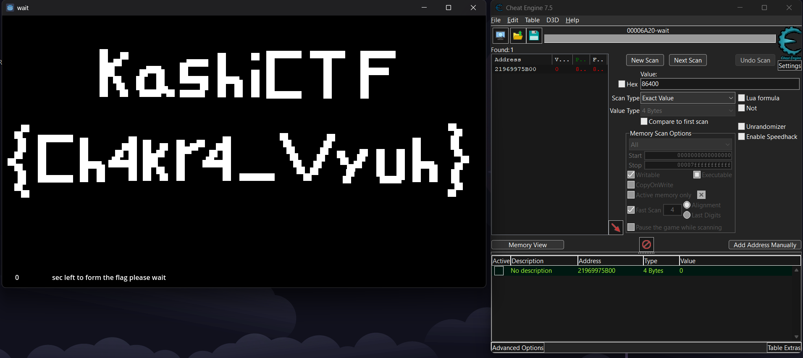

> We made a game.
>
> https://drive.google.com/file/d/1GDYmOiW54pPLFxfQaBOOS5IPEAoplFPy/view?usp=drive_link

---

So we have a game that we can play. We can play the game and see that we have to wait for `172800` seconds to get the flag.

We can use **Cheat Engine** to change the value of the timer to `0` and get the flag. Search for the value like `3600` or `86400` and change it to `0`.

Another method is to **manually change the system time** far into the future, which tricks the game into thinking the wait time has elapsed.
