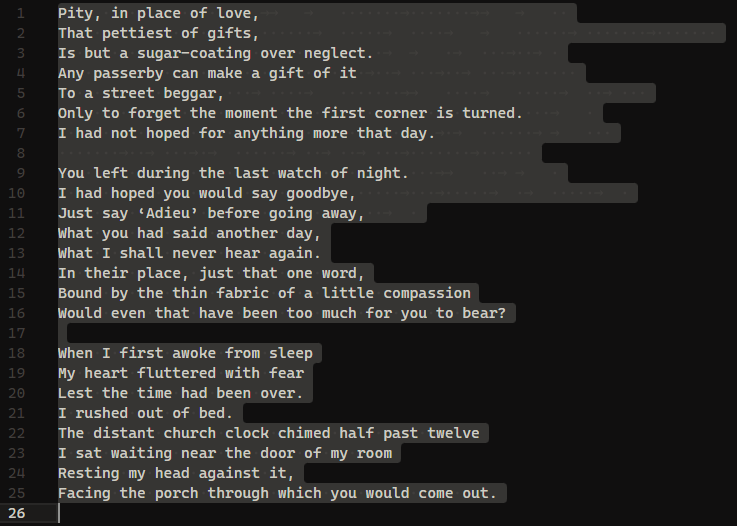
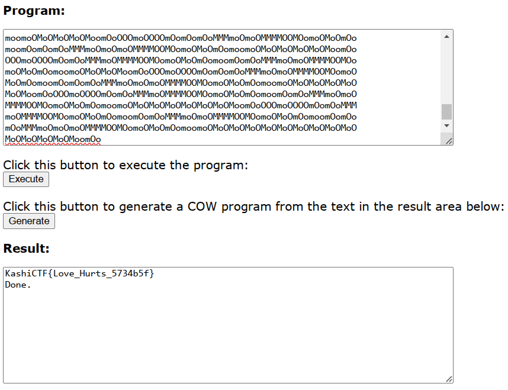

> A friend of mine , Aakash has gone missing and the only thing we found is this poem...Weirdly, he had a habit of keeping his name as the password.

---

The challenge provides a poem in the form of a text file.



After analyzing the given poem, a keyword search for Whitespace steganography led to the discovery of the [SNOW](https://github.com/mattkwan-zz/snow) tool, which hides data in text files using whitespace characters.

```sh
$ /mnt/c/Users/zenta/Downloads/snwdos32/SNOW.EXE --help
Illegal option '--help'
Usage: SNOW.EXE [-C][-Q][-S][-p passwd][-l line-len] [-f file | -m message]
                                        [infile [outfile]]
```

Based on the help message, we can use `-p` to specify the password. From the description, we know that the password is `Aakash`. The `-C` option is used to uncompress the output. The input file is `poemm.txt`.

```sh
$ /mnt/c/Users/zenta/Downloads/snwdos32/SNOW.EXE -p Aakash -C poemm.txt
https://pastebin.com/HVQfa14Z
```

The output is a pastebin link. Open the link and we found some text.

```
OOOMoOMoOMoOMoOMoOMoOMoOMoOMMMmoOMMMMMMmoOMMMMOOMOomOoMoOmoOmoomOo
MMMmoOMMMMMMmoOMMMMOOMOomOoMoOmoOmoomOoMMMmoOMMMMMMmoOMMMMOOMOomOo
MoOmoOmooOOOmoOOOOmOomOoMMMmoOMMMMOOMOomoOMoOmOomoomoOMoOMoOMoOMoO
MoOMoOMoOMoOMoOMoOMoOMoomOoOOOmoOOOOmOomOoMMMmoOMMMMOOMOomoOMoOmOo
moomOomOoMMMmoOmoOMMMMOOMOomoOMoOmOomoomoOMoOMoomOoOOOmoOOOOmOomOo
MMMmoOMMMMOOMOomoOMoOmOomoomOomOoMMMmoOmoOMMMMOOMOomoOMoOmOomoomOo
mOomOoMMMmoOmoOmoOMMMMOOMOomoOMoOmOomoomoOMoOMoOMoOMoomOoOOOmoOOOO
mOomOoMMMmoOMMMMOOMOomoOMoOmOomoomOomOoMMMmoOmoOMMMMOOMOomoOMoOmOo
moomoOMoOMoOMoOMoOMoOMoOMoOMoOMoomOoOOOmoOOOOmOomOoMMMmoOMMMMOOMOo
moOMoOmOomoomOomOoMMMmoOmoOMMMMOOMOomoOMoOmOomoomoOMoOMoOMoOMoOMoO
MoOMoOMoOMoOMoomOoOOOmoOOOOmOomOoMMMmoOMMMMOOMOomoOMoOmOomoomoOMoO
MoOMoOMoomOoOOOmoOOOOmOomOoMMMmoOMMMMOOMOomoOMoOmOomoomOomOomOoMMM
moOmoOmoOMMMMOOMOomoOMoOmOomoomoOMoOMoOMoOMoOMoomOoOOOmoOOOOmOomOo
MMMmoOMMMMOOMOomoOMoOmOomoomoOMoOMoOMoOMoOMoOMoOMoomOoOOOmoOOOOmOo
mOoMMMmoOMMMMOOMOomoOMoOmOomoomOomOoMMMmoOmoOMMMMOOMOomoOMoOmOomoo
mOomOomOoMMMmoOmoOmoOMMMMOOMOomoOMoOmOomoomoOMoOMoOMoOMoOMoOMoOMoO
MoOMoOMoOMoOMoomOoOOOmoOOOOmOomOoMMMmoOMMMMOOMOomoOMoOmOomoomoOMoO
MoOMoOMoOMoOMoOMoOMoOMoOMoOMoOMoOMoomOoOOOmoOOOOmOomOoMMMmoOMMMMOO
MOomoOMoOmOomoomOomOoMMMmoOmoOMMMMOOMOomoOMoOmOomoomoOMoOMoOMoOMoO
MoOMoOMoOMoOMoOMoOMoOMoOMoOMoOMoOMoomOoOOOmoOOOOmOomOoMMMmoOMMMMOO
MOomoOMoOmOomoomOomOoMMMmoOmoOMMMMOOMOomoOMoOmOomoomOomOomOoMMMmoO
moOmoOMMMMOOMOomoOMoOmOomoomoOMoOMoOMoOMoOMoOMoOMoomOoOOOmoOOOOmOo
mOoMMMmoOMMMMOOMOomoOMoOmOomoomOomOoMMMmoOmoOMMMMOOMOomoOMoOmOomoo
moOMoOMoOMoOMoOMoOMoomOoOOOmoOOOOmOomOoMMMmoOMMMMOOMOomoOMoOmOomoo
mOomOomOoMMMmoOmoOmoOMMMMOOMOomoOMoOmOomoomoOMoOMoOMoOMoOMoOMoOMoO
MoOMoOMoOMoOMoOMoOMoOMoOMoomOoOOOmoOOOOmOomOoMMMmoOMMMMOOMOomoOMoO
mOomoomoOMoOMoOMoOMoOMoOMoOMoOMoOMoomOoOOOmoOOOOmOomOoMMMmoOMMMMOO
MOomoOMoOmOomoomOomOoMMMmoOmoOMMMMOOMOomoOMoOmOomoomOomOomOoMMMmoO
moOmoOMMMMOOMOomoOMoOmOomoomoOMoOMoOMoOMoOMoOMoomOoOOOmoOOOOmOomOo
MMMmoOMMMMOOMOomoOMoOmOomoomOomOoMMMmoOmoOMMMMOOMOomoOMoOmOomoomOo
mOomOoMMMmoOmoOmoOMMMMOOMOomoOMoOmOomoomoOMoOMoOMoomOoOOOmoOOOOmOo
mOoMMMmoOMMMMOOMOomoOMoOmOomoomOomOoMMMmoOmoOMMMMOOMOomoOMoOmOomoo
mOomOomOoMMMmoOmoOmoOMMMMOOMOomoOMoOmOomoomoOMoOMoOMoOMoOMoomOoOOO
moOOOOmOomOoMMMmoOMMMMOOMOomoOMoOmOomoomOomOoMMMmoOmoOMMMMOOMOomoO
MoOmOomoomOomOomOoMMMmoOmoOmoOMMMMOOMOomoOMoOmOomoomoOMoOMoOMoOMoo
mOoOOOmoOOOOmOomOoMMMmoOMMMMOOMOomoOMoOmOomoomOomOomOoMMMmoOmoOmoO
MMMMOOMOomoOMoOmOomoomoOMoOMoOMoOMoOMoOMoOMoOMoOMoOMoOMoOMoOMoOMoO
MoOMoomOoOOOmoOOOOmOomOomOoMMMmoOmoOMMMMOOMOomoOMoOmOomoomOomOomOo
MMMmoOmoOmoOMMMMOOMOomoOMoOmOomoomoOMoOMoOMoOMoOMoOMoomOoOOOmoOOOO
mOomOomOoMMMmoOmoOMMMMOOMOomoOMoOmOomoomOomOomOoMMMmoOmoOmoOMMMMOO
MOomoOMoOmOomoomoOMoOMoOMoOMoOMoOMoOMoOMoomOoOOOmoOOOOmOomOomOoMMM
moOmoOMMMMOOMOomoOMoOmOomoomOomOomOoMMMmoOmoOmoOMMMMOOMOomoOMoOmOo
moomoOMoOMoOMoOMoomOoOOOmoOOOOmOomOomOoMMMmoOmoOMMMMOOMOomoOMoOmOo
moomOomOomOoMMMmoOmoOmoOMMMMOOMOomoOMoOmOomoomoOMoOMoOMoOMoOMoomOo
OOOmoOOOOmOomOoMMMmoOMMMMOOMOomoOMoOmOomoomOomOoMMMmoOmoOMMMMOOMOo
moOMoOmOomoomoOMoOMoOMoomOoOOOmoOOOOmOomOomOoMMMmoOmoOMMMMOOMOomoO
MoOmOomoomOomOomOoMMMmoOmoOmoOMMMMOOMOomoOMoOmOomoomoOMoOMoOMoOMoO
MoOMoomOoOOOmoOOOOmOomOoMMMmoOMMMMOOMOomoOMoOmOomoomOomOoMMMmoOmoO
MMMMOOMOomoOMoOmOomoomoOMoOMoOMoOMoOMoOMoOMoomOoOOOmoOOOOmOomOoMMM
moOMMMMOOMOomoOMoOmOomoomOomOoMMMmoOmoOMMMMOOMOomoOMoOmOomoomOomOo
mOoMMMmoOmoOmoOMMMMOOMOomoOMoOmOomoomoOMoOMoOMoOMoOMoOMoOMoOMoOMoO
MoOMoOMoOMoOMoomOo
```

The text contained patterns resembling **Cow Programming Language**, an esoteric language that uses `O`, `M`, and `o` characters.

To decode this, an online Cow Language Interpreter was used: https://frank-buss.de/cow.html


