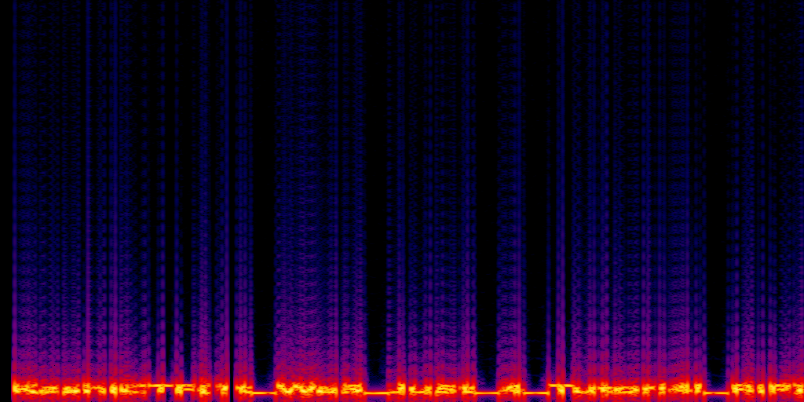

> We made a game.
>
> https://drive.google.com/file/d/1R5EdsswQydsUQZIToQDkR-1CpwRIzmiK/view?usp=drive_link

---

In this challenge, we were given a `Unity` game file and needed to extract the hidden flag through reverse engineering.

## Steps to Extract the Flag

1. Decompiling the Game
    - We can decompile the game using a tool like [AssetRipper](https://github.com/AssetRipper/AssetRipper).
2. Extracting the Audio Clip
    - From the extracted assets, an `AudioClip` directory was identified as a potential source of the flag.
3. Converting to Spectrogram
    - The file in `AudioClip` was converted into a spectrogram using a tool like `Sonic Visualiser` or `AudaCity`.
    - The spectrogram revealed the hidden flag embedded within the audio.

By analyzing the spectrogram, we successfully retrieved the flag:

