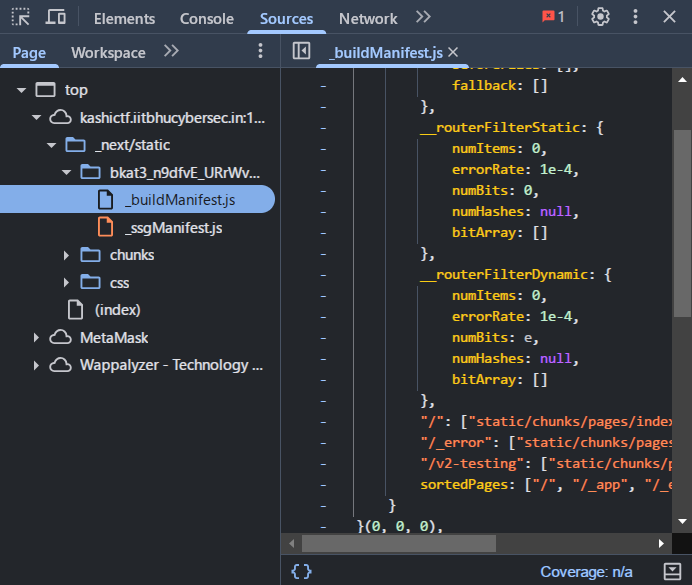
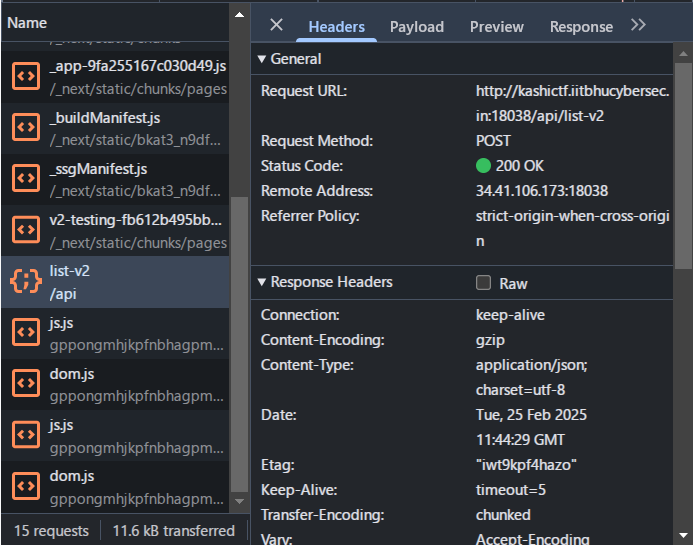
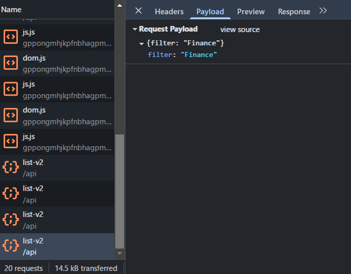

> The Request Management App is used to view all pending requests for each user. It’s a pretty basic website, though I heard they were working on something new.
>
> Anyway, did you know that one of the disgruntled employees shared some company secrets on the Requests Management App, but it's status was set denied before I could see it. Please find out what it was and spill the tea!
>
> `This Challenge unlocks another challenge in this Series`

---

Given a website that uses `Next.js`. This website has a feature to view pending requests. Since there are no interesting network requests, i tried to look at the source code of this website.



In the source code i found a path `/v2-testing` in the `_buildManifest.js` file. i tried to access the path and found a form asking for input and a filter.





After filtering we can see on the network that it will make a request to `/api/list-v2` with the `POST` method. I tried to do **SQL Injection** with the payload `' OR 1=1 --` and managed to get the flag.

Payload:

```json
{
  "filter": "' OR 1=1 --"
}
```
