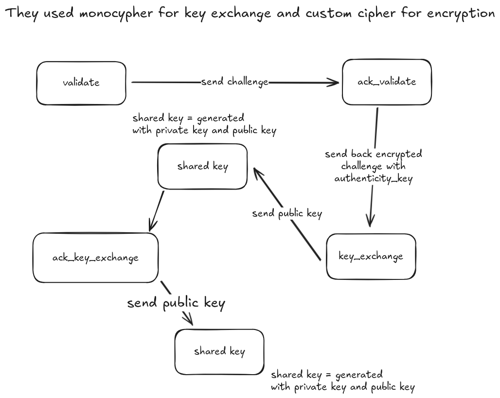
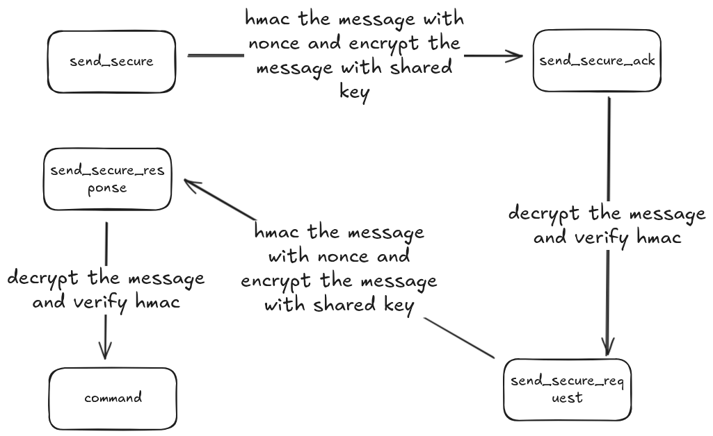
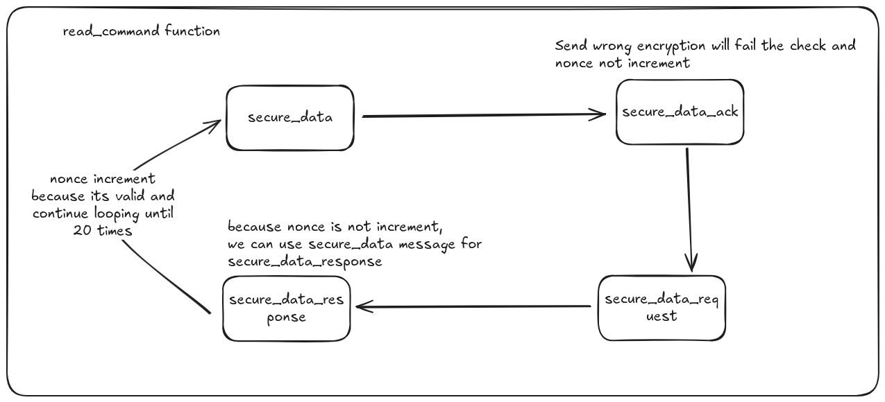

> I bought this robot to help me locate flags, but the controller is stuck in a demo loop where the robot just goes in circles. Can you exploit the encryption between the controller to navigate the robot to the flag?
> All connections to the challenge will be made via the browser and/or HTTP requests to the server. You will need to use the functions provided in [radio_interface.py]() to interface with the server. The source code for the robot and controller will be useful as well: [robot.py](); [robotcontroller.py](); [crypto.py]()

by asinghani

---

<details>
<summary>Hint 1</summary>

Don't forget that you can restart your instance if it gets in a bad state
</details>

---




```py
async def send_secure_data(self, msg):
    msg_encrypted = self.hmac_and_encrypt(msg, self.nonce)
    self.send_message({
        "msg_type": "secure_data",
        "src": self.address,
        "dst": ROBOT_ADDRESS,
        "encrypted": msg_encrypted
    })

    response = await self.wait_message("secure_data_ack")
    ack_decrypted = self.decrypt_and_check_hmac(response["encrypted"], self.nonce)

    if ack_decrypted is None:
        self.debug("acknowledgement failed to validate")
        return

    # Ack packets are zero length
    if len(ack_decrypted) != 0:
        self.debug("acknowledgement mismatch")
        return

    self.nonce += 1

async def recv_secure_data(self):
    # Zero length packet as a secure data request
    msg_encrypted = self.hmac_and_encrypt("", self.nonce)
    self.send_message({
        "msg_type": "secure_data_request",
        "src": self.address,
        "dst": ROBOT_ADDRESS,
        "encrypted": msg_encrypted
    })

    response = await self.wait_message("secure_data_response")
    response_decrypted = self.decrypt_and_check_hmac(response["encrypted"], self.nonce)

    if response_decrypted is None:
        self.debug("response failed to validate")
        return

    self.nonce += 1

    return response_decrypted

async def read_command(self):
    await self.send_secure_data("get_movement")
    await asyncio.sleep(0.2)

    while True:
        resp = await self.recv_secure_data()
        if resp != "":
            return resp
```

Here is the vulnerable code in the `robot.py` file. We can see that the `send_secure_data` function sends the encrypted message to the robot and waits for an acknowledgment. The acknowledgment is decrypted and checked for HMAC. If the acknowledgment is valid, the nonce is incremented by 1. The `recv_secure_data` function sends a request for secure data and waits for a response. The response is decrypted and checked for HMAC. If the response is valid, the nonce is incremented by 1 and the decrypted response is returned. The `read_command` function sends a request for secure data with the message "get_movement" and then waits for a response. If the response is not empty, it is returned.

So because while sending `get_movement` message, the robot sends back the movement commands ("east", "south", "west", "north").

```py
self.send_buffer_secure = ["east", "south", "west", "north"][self.movement_counter % 4]
```

Every `get_movement` message will return the next movement command in the list. So we can send multiple `get_movement` messages to get all the movement commands.

But how we can send multiple `get_movement` messages since the nonce increment by two every `read_command` and we don't know the shared key of the hmac?

Yes!! we can make `read_command` only increment one nonce by send invalid `secure_data_ack`.



But its only generate 20 nonces and we need about 29 nonces to make the bot find the flag. So we need to send valid `secure_data_ack` for the first 20 nonces (because every `read_command` will increment the nonce by 2, we just need 10 looping and we have 10 looping left) and then send invalid `secure_data_ack` for the next nonces. Repeat until we get all the nonces.

Before we start, we need to make a proxy for the middle so we can use our own public key to encrypt and decrypt the message.

```py
inject_radio_message({
    "msg_type": "set_addr",
    "src": FAKE_ADDRESS,
    "dst": ROBOT_ADDRESS,
    "new_addr": FAKE_ROBOT_ADDRESS
})
```

Because there is `set_addr` message type in controller, we can change the robot address to our fake robot address so we can intercept the message first and then forward it to the controller.

```py
private_key = os.urandom(32)
inject_radio_message({
    "msg_type": "key_exchange",
    "src": FAKE_ADDRESS,
    "dst": FAKE_ROBOT_ADDRESS,
    "key": monocypher.compute_key_exchange_public_key(private_key).hex()
})
inject_radio_message({
    "msg_type": "ack_key_exchange",
    "src": FAKE_ROBOT_ADDRESS,
    "dst": ADDRESS,
    "key": monocypher.compute_key_exchange_public_key(private_key).hex()
})

# And we can make shared key for robot and controller
```

When we forward message to controller or robot, we need to decrypt the message first and then encrypt it again with the shared key coresponging to the destination address, if destination address is robot, we use the shared key of the robot, if destination address is controller, we use the shared key of the controller.
