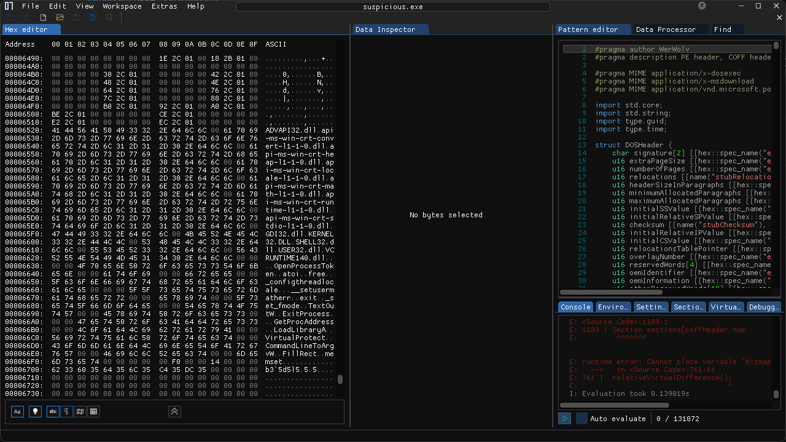
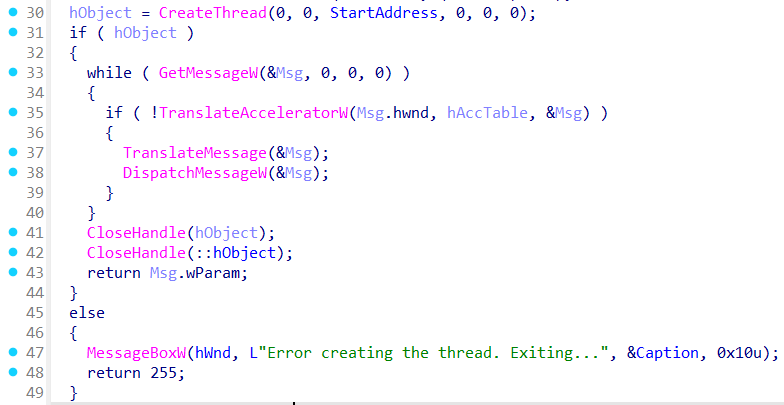

> Dear Threat Intelligence Analyst,
> Quick heads up - we stumbled upon a shady executable file on one of our employee's Windows PCs. Good news: the employee didn't take the bait and flagged it to our InfoSec crew.
> Seems like this file sneaked past our Intrusion Detection Systems, indicating a fresh threat with no matching signatures in our database.
> Can you dive into this file and whip up some YARA rules? We need to make sure we catch this thing if it pops up again.
> Thanks a bunch!
> The suspicious file can be downloaded [here](). Unzip the archive with the password `picoctf`

by Nandan Desai / syreal

---

<details>
<summary>Hint 1</summary>

The test cases will attempt to match your rule with various variations of this suspicious file, including a packed version, an unpacked version, slight modifications to the file while retaining functionality, etc.
</details>

<details>
<summary>Hint 2</summary>

Since this is a Windows executable file, some strings within this binary can be "wide" strings. Try declaring your string variables something like `$str = "Some Text" wide ascii` wherever necessary.
</details>

<details>
<summary>Hint 3</summary>

Your rule should also not generate any false positives (or false negatives). Refine your rule to perfection! One YARA rule file can have multiple rules! Maybe define one rule for Packed binary and another rule for Unpacked binary in the same rule file?
</details>

---

```sh
$ strings suspicious.exe               
!This program cannot be run in DOS mode.
xRich
UPX0
UPX1
.rsrc
4.21
UPX!
kxvx+
g&0K(u(H,^
```





```c
void __stdcall __noreturn StartAddress(LPVOID lpThreadParameter)
{
  WCHAR Filename[260]; // [esp+0h] [ebp-378h] BYREF
  CHAR CommandLine[272]; // [esp+208h] [ebp-170h] BYREF
  _STARTUPINFOA StartupInfo; // [esp+318h] [ebp-60h] BYREF
  DWORD CurrentProcessId; // [esp+360h] [ebp-18h]
  _PROCESS_INFORMATION ProcessInformation; // [esp+364h] [ebp-14h] BYREF
  DWORD ExitCode; // [esp+374h] [ebp-4h] BYREF

  memset(&StartupInfo, 0, sizeof(StartupInfo));
  StartupInfo.cb = 68;
  memset(&ProcessInformation, 0, sizeof(ProcessInformation));
  ExitCode = 0;
  CurrentProcessId = GetCurrentProcessId();
  GetModuleFileNameW(0, Filename, 0x104u);
  snprintf(CommandLine, 0x110u, "%ws %d", Filename, CurrentProcessId);
  while ( CreateProcessA(0, CommandLine, 0, 0, 0, 0, 0, 0, &StartupInfo, &ProcessInformation) )
  {
    WaitForSingleObject(ProcessInformation.hProcess, 0xFFFFFFFF);
    GetExitCodeProcess(ProcessInformation.hProcess, &ExitCode);
    switch ( ExitCode )
    {
      case 0xFFu:
        MessageBoxW(hWnd, L"Something went wrong.", &Caption, 0x10u);
        sub_401860(255);
      case 0xFEu:
        MessageBoxW(
          hWnd,
          L"The debugger was detected but our process wasn't able to fight it. Exiting the program.",
          &Caption,
          0x10u);
        sub_401860(255);
      case 0xFDu:
        MessageBoxW(
          hWnd,
          L"Our process detected the debugger and was able to fight it. Don't be surprised if the debugger crashed.",
          &Caption,
          0x10u);
        break;
    }
    CloseHandle(ProcessInformation.hProcess);
    CloseHandle(ProcessInformation.hThread);
    Sleep(0x1388u);
  }
  MessageBoxW(hWnd, L"[FATAL ERROR]  Unable to create the child process.", &Caption, 0x10u);
  sub_401860(255);
}
```

```txt
rule RulesA
{
    strings:
        $a = "GetCurrentProcessId" wide ascii
        $b = "GetModuleFileNameW" wide ascii
        $c = "CreateProcessA" wide ascii
        $d = "GetExitCodeProcess" wide ascii
        $e = "The debugger was detected" wide ascii
        $f = "[FATAL ERROR]" wide ascii
    
    condition:
        all of them
}

// Useless but why not
rule RulesB
{
    strings:
        $a = "OpenProcessToken" wide ascii
        $b = "LookupPrivilegeValueW" wide ascii
        $c = "AdjustTokenPrivileges" wide ascii
        $d = "Please run" wide ascii
        $e = "this program" wide ascii
        $f = "as an Admin" wide ascii
    
    condition:
        all of them
}

// Detect ExitProcess, GetProcAddress, LoadLibraryA, VirtualProtect, and CommandLineToArgvW from packed file (idk why works LOL)
rule RulesC
{
    strings:
        $a = { 45 78 69 74 50 72 6F 63 65 73 73 00 00 00 47 65 74 50 72 6F 63 41 64 64 72 65 73 73 00 00 4C 6F 61 64 4C 69 62 72 61 72 79 41 00 00 56 69 72 74 75 61 6C 50 72 6F 74 65 63 74 00 00 43 6F 6D 6D 61 6E 64 4C 69 6E 65 54 6F 41 72 67 76 57 }
    
    condition:
        all of them
}
```

Once you have created the YARA rule/signature, submit your rule file as follows:
`socat -t60 - TCP:standard-pizzas.picoctf.net:53755 < sample.txt`
(In the above command, modify "sample.txt" to whatever filename you use).
When you submit your rule, it will undergo testing with various test cases. If it successfully passes all the test cases, you'll receive your flag.

```sh
(cat rules.yar; cat) | nc <IP> <PORT>
:::::

Status: Passed
Congrats! Here is your flag: picoCTF{REDACTED}

:::::
```

```sh
$ (cat rules.yar; cat) | nc standard-pizzas.picoctf.net 53755
:::::

Status: Failed
False Negatives Check: Testcase failed. Your rule generated a false negative.
False Positives Check: Testcases passed!
Stats: 61 testcase(s) passed. 1 failed. 2 testcase(s) unchecked. 64 total testcases.
Pass all the testcases to get the flag.

:::::
```
