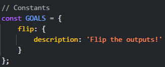

> History has failed us, but no matter.

by notdeghost

---

We are given a website with a simple interface that allows us to create a circuit and check it. The circuit is defined by a list of objects with `input1`, `input2`, and `output` keys. The circuit is then serialized and sent to the server to be executed.

Viewing the source code of the website, we see that the `GOALS` constants variables which contaions goals to get the flag.



Okay so we need to create a circuit that will flip the bits of the output. We can do this by using the `nand` gate. The `nand` gate is a universal gate, which means that any boolean function can be implemented using only `nand` gates.

```js
// Add the check endpoint
app.post('/check', async (req, res) => {
    const circuit = req.body.circuit;

    if (!Array.isArray(circuit) || 
        !circuit.every(entry => checkInt(entry?.input1) && 
                                checkInt(entry?.input2) && 
                                checkInt(entry?.output))) {
        return res.status(400).end();
    }

    const program = await fs.readFile('./programs/nand_checker.bin');
    
    // Generate random input state with only 0x0000 or 0xffff values
    const inputState = new Uint16Array(4);
    for (let i = 0; i < 4; i++) {
        inputState[i] = Math.random() < 0.5 ? 0x0000 : 0xffff;
    }
    
    // Create output state as inverse of input
    const outputState = new Uint16Array(4);
    for (let i = 0; i < 4; i++) {
        outputState[i] = inputState[i] === 0xffff ? 0x0000 : 0xffff;
    }
    
    const serialized = serializeCircuit(
        circuit,
        program,
        inputState,
        outputState
    );

    doRun(res, serialized);
});
```

The server uses a binary file `nand_checker.bin` to check the circuit. And the input state is generated randomly with only `0x0000` or `0xffff` values. The output state is the inverse of the input state.

So because the output state is the inverse of the input state, we can use the `nand` gate to flip the bits of the output state using the input state.

Payload to flip the bits of the output:

```json
{
  "circuit": [
    {"input1": 5, "input2": 5, "output": 1},
    {"input1": 6, "input2": 6, "output": 2},
    {"input1": 7, "input2": 7, "output": 3},
    {"input1": 8, "input2": 8, "output": 4},
  ]
}
```

Sadly i can't solve **Pachinko Revisit** :(
