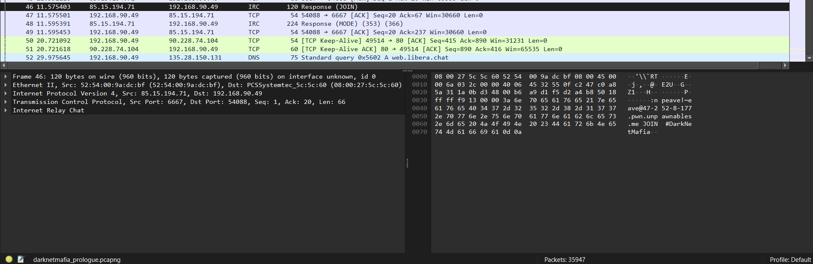
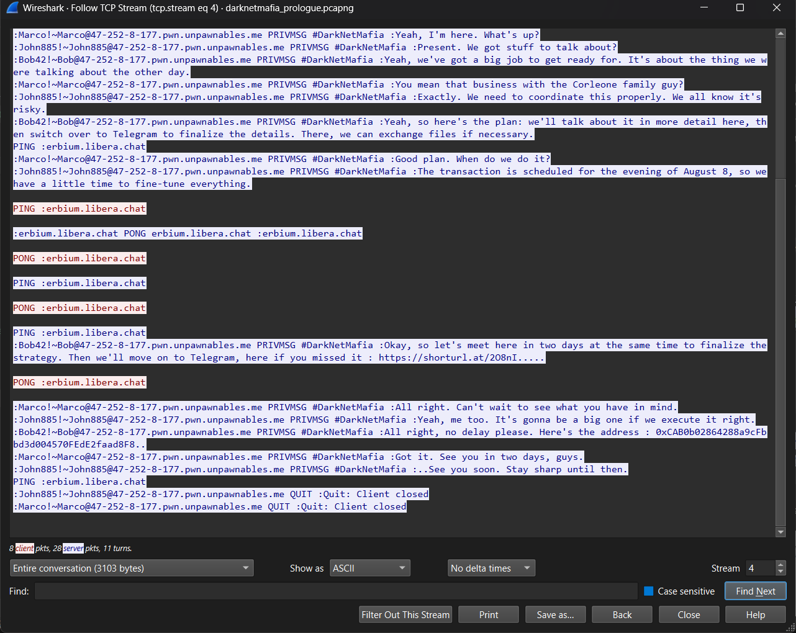
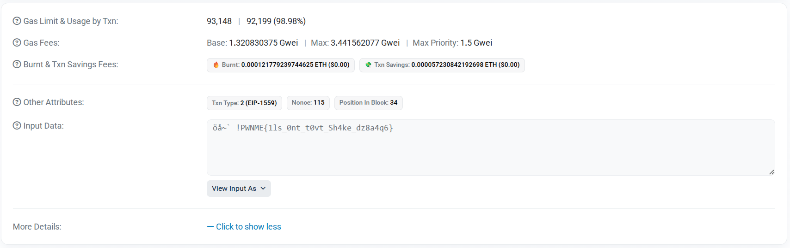

> You're an agent, your unit recently intercepted a mob discussion about an event that's going to take place on August 8, 2024. You already know the location, though. A password for the event was mentioned. Your job is to find it and return it so that an agent can go to the scene and collect evidence.
>
> Note : The contract is deployed on sepolia network
>
> Authors : `wepfen, teazer`
>
> Flag format: `PWNME{.........................}`

by wepfen and teazer

---

Another PCAP challenge. This time we have a PCAP file with a lot of traffic. We found the IRC traffic.

Following the TCP stream and we found chat messages.

In the chat, we found the contract address `0xCAB0b02864288a9cFbbd3d004570FEdE2faad8F8`, because the contract is deployed on the sepolia network, we can find the contract on the [etherscan](https://sepolia.etherscan.io/).

