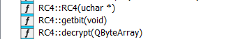
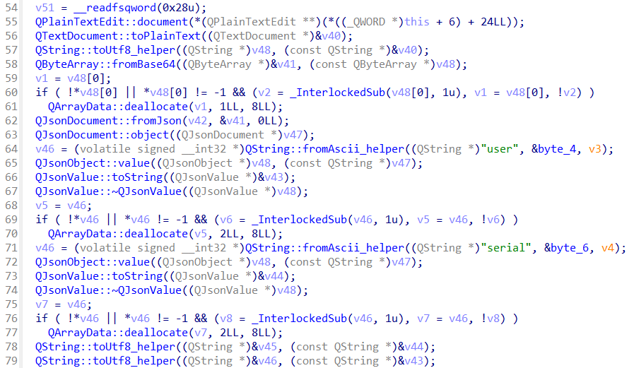
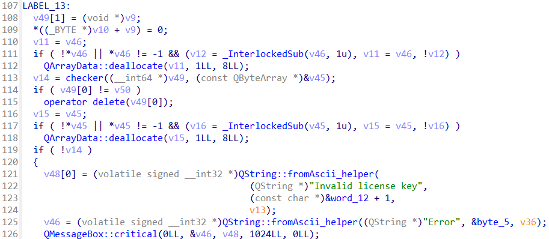

> Using the license of 'Noa' and the provided binary, develop a keygen to create a valid license for the 100 requested users.
>
> Author : `Fayred`
>
> Flag format: `PWNME{.........................}`
>
> Connect : `nc --ssl [Host] 443`

by Fayred

---

They provide a binary and a license for user `Noa`. The binary is a **QT application** that reads a license key from the user and validates it. The license key is a base64 encoded **JSON** object with the user and the serial key. The serial key is encrypted using the **RC4** algorithm with a random key generated from the **CRC32** of the user. The encrypted data is then hashed using **SHA1** and compared with the expected hash.

We start by analyzing the given license for Noa, which is:
```
eyJ1c2VyIjogIk5vYSIsICJzZXJpYWwiOiAiZTNiZmJkZjE2MzE0ZWJlZDdiZDJjNjA4YWU1MzA2OTI3MjRjYzNhNSJ9
```

Decoding it from base64 gives: 

```json
{
  "user": "Noa",
  "serial": "e3bfbdf16314ebed7bd2c608ae530692724cc3a5"
}
```

Decompiling the binary, we see that this is `QT` application. The binary reads the user input to validate the license.



We can see that the binary calls had a class `RC4` and a function `checker` that validates the license. The `checker` function is called when the user clicks the button `on_checkKey_clicked`.



In the `on_checkKey_clicked` function, the input from the user is decoded from base64 and passed to the `checker` function.



The `checker` function is responsible for validating the license. The decompiled code of the `checker` function is as follows:

```c
__int64 __fastcall checker(__int64 *a1, const QByteArray *a2)
{
  __int64 v3; // rdx
  __int64 v4; // rsi
  unsigned int v5; // eax
  int v6; // ebx
  volatile signed __int32 *v7; // rdi
  signed __int32 v8; // et0
  volatile signed __int32 **v9; // r13
  unsigned int v10; // edx
  _BYTE *v11; // rax
  unsigned __int64 v12; // rsi
  __int64 v13; // rax
  volatile signed __int32 *v14; // rdi
  __int64 v15; // r12
  signed __int32 v16; // et0
  volatile signed __int32 *v17; // rdi
  signed __int32 v18; // et0
  volatile signed __int32 *v19; // rdi
  signed __int32 v20; // et0
  volatile signed __int32 *v22; // [rsp+8h] [rbp-160h] BYREF
  volatile signed __int32 *v23; // [rsp+10h] [rbp-158h] BYREF
  volatile signed __int32 *v24; // [rsp+18h] [rbp-150h] BYREF
  unsigned __int8 v25[276]; // [rsp+20h] [rbp-148h] BYREF
  unsigned __int8 v26[4]; // [rsp+134h] [rbp-34h] BYREF
  unsigned __int64 v27; // [rsp+138h] [rbp-30h]

  v3 = *((unsigned int *)a1 + 2);
  v4 = *a1;
  v27 = __readfsqword(0x28u);
  v5 = crc32(0LL, v4, v3);
  srand(v5);
  v6 = rand();
  *(_DWORD *)v26 = _byteswap_ulong(rand() % 0xFFFF * (v6 % 0xFFFF));
  RC4::RC4((RC4 *)v25, v26);
  QByteArray::fromHex((QByteArray *)&v24, a2);
  RC4::decrypt((QByteArray *)&v22, (RC4 *)v25, (__int64 *)&v24);
  v7 = v24;
  if ( !*v24 || *v24 != -1 && (v8 = _InterlockedSub(v24, 1u), v7 = v24, !v8) )
    QArrayData::deallocate(v7, 1LL, 8LL);
  v9 = &v23;
  QCryptographicHash::hash(&v23, &v22, 2LL);
  QByteArray::toHex((QByteArray *)&v24);
  v10 = *((_DWORD *)v24 + 1);
  if ( v10 )
  {
    v11 = (char *)v24 + *((_QWORD *)v24 + 2);
    v12 = 0LL;
    while ( *v11 )
    {
      v12 = (unsigned int)(v12 + 1);
      ++v11;
      if ( v10 == (_DWORD)v12 )
      {
        v12 = v10;
        break;
      }
    }
  }
  else
  {
    v12 = 0LL;
  }
  v13 = QString::fromAscii_helper((QString *)((char *)v24 + *((_QWORD *)v24 + 2)), (const char *)v12, v10);
  v14 = v24;
  v15 = v13;
  if ( !*v24 || *v24 != -1 && (v16 = _InterlockedSub(v24, 1u), v14 = v24, !v16) )
    QArrayData::deallocate(v14, 1LL, 8LL);
  v17 = v23;
  if ( !*v23 || *v23 != -1 && (v18 = _InterlockedSub(v23, 1u), v17 = v23, !v18) )
    QArrayData::deallocate(v17, 1LL, 8LL);
  LOBYTE(v9) = (unsigned int)QString::compare_helper(
                               v15 + *(_QWORD *)(v15 + 16),
                               *(unsigned int *)(v15 + 4),
                               "b039d6daea04c40874f80459bff40142bd25b995",
                               0xFFFFFFFFLL,
                               1LL) == 0;
  if ( !*(_DWORD *)v15 || *(_DWORD *)v15 != -1 && !_InterlockedSub((volatile signed __int32 *)v15, 1u) )
    QArrayData::deallocate(v15, 2LL, 8LL);
  v19 = v22;
  if ( !*v22 || *v22 != -1 && (v20 = _InterlockedSub(v22, 1u), v19 = v22, !v20) )
    QArrayData::deallocate(v19, 1LL, 8LL);
  return (unsigned int)v9;
}
```

Where arguments are:

- `a1` is the user
- `a2` is the serial key

The function `checker` does the following:

1. Calculate the **CRC32** of the user
2. Seed the random number generator with the **CRC32** value
3. Generate a random key
4. Initialize the RC4 object with the random key
5. Decrypt the serial key
6. Calculate the SHA1 hash of the decrypted serial key
7. Compare the hash with the expected hash

So to generate a valid license for a user, we need to:

1. Calculate the CRC32 of the user
2. Seed the random number generator with the CRC32 value
3. Generate a random key
4. Initialize the RC4 object with the random key
5. Encrypt the data
6. Send the base64 encoded JSON object with the user and the encrypted data

We the create a Python script to automate the process. It performs the necessary transformations and sends valid licenses to the challenge server for 100 different users.

```py
from pwn import *
import ctypes
import binascii
import hashlib
import base64
import json

libc = ctypes.CDLL('libc.so.6')
libc.srand(libc.time(0))

class RC4:
    def __init__(self, key: bytes):
        # Initialize the array with values 0-255
        self.state = [i for i in range(256)]
        # Reset position tracking
        self.x = 0
        self.y = 0
        
        # Key scheduling algorithm
        j = 0
        for i in range(256):
            # In C++ code, a2[v3 & 3] is accessing key with modulo 4
            # Assuming key is a bytes object or bytearray
            j = (j + self.state[i] + key[i % len(key)]) & 0xFF
            # Swap values
            self.state[i], self.state[j] = self.state[j], self.state[i]
            
    def get_bit(self):
        # Increment x and wrap around to stay within 0-255
        self.x = (self.x + 1) % 256
        
        # Get value at state[x]
        x_val = self.state[self.x]
        
        # Update y using value at state[x]
        self.y = (self.y + x_val) % 256
        
        # Swap values at state[x] and state[y]
        self.state[self.x], self.state[self.y] = self.state[self.y], self.state[self.x]
        
        # Return value at state[(state[x] + state[y]) % 256]
        return self.state[(self.state[self.x] + self.state[self.y]) % 256]
        
    def decrypt(self, encrypted_data: bytes):
        result = bytearray()
        
        for byte in encrypted_data:
            # XOR each byte with the next byte from the RC4 keystream
            decrypted_byte = byte ^ self.get_bit()
            result.append(decrypted_byte)
            
        return bytes(result)
    
    def encrypt(self, data: bytes):
        return self.decrypt(data)

def decrypt(key, data):
    crc32_value = binascii.crc32(key)
    libc.srand(crc32_value)

    v6 = libc.rand()
    random_key = libc.rand() % 0xFFFF * (v6 % 0xFFFF)
    random_key = random_key.to_bytes(4, 'big')

    rc4 = RC4(random_key)
    return rc4.decrypt(binascii.unhexlify(data))

def encrypt(key, data):
    crc32_value = binascii.crc32(bytearray(key))
    libc.srand(crc32_value)

    v6 = libc.rand()
    random_key = libc.rand() % 0xFFFF * (v6 % 0xFFFF)
    random_key = random_key.to_bytes(4, 'big')

    rc4 = RC4(random_key)

    encrypted_data = rc4.encrypt(data)
    return encrypted_data.hex()

def checker(key, data):
    sha1_hash = hashlib.sha1(decrypt(key, data)).hexdigest()

    expected_hash = "b039d6daea04c40874f80459bff40142bd25b995"
    return sha1_hash == expected_hash

data = decrypt(b'Noa',b'e3bfbdf16314ebed7bd2c608ae530692724cc3a5')
print(f'Decrypted data: {data}')
print(f'Encrypted data: {encrypt(b"Noa", data)}')
print(f'Checker: {checker(b"Noa", b"e3bfbdf16314ebed7bd2c608ae530692724cc3a5")}')

context.log_level = 'debug'

r = remote('c4license-3a7a8c81137937c1.deploy.phreaks.fr', 443, ssl=True)

current = 0
while True:
    r.recvuntil(b'Your license for ')
    user = r.recv()
    user = user.split(b' ')[0]

    json_data = {
        'user': user.decode(),
        'serial': encrypt(user, data)
    }
    base64_json = base64.b64encode(json.dumps(json_data).encode()).decode()
    r.sendline(base64_json)

    current += 1
    if current == 100:
        break

r.interactive()
```
