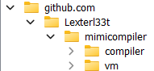
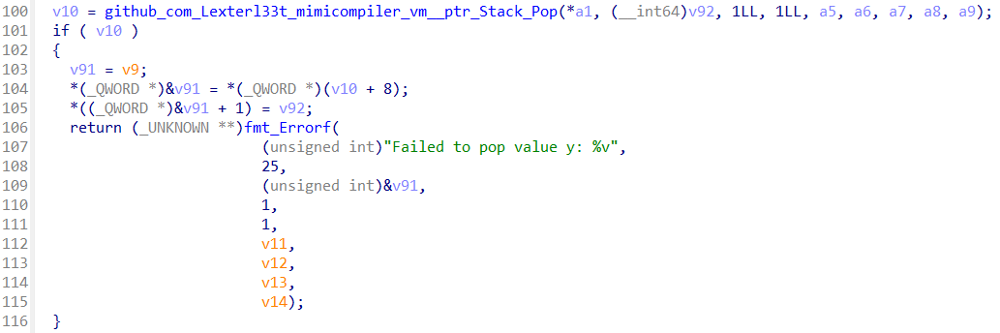
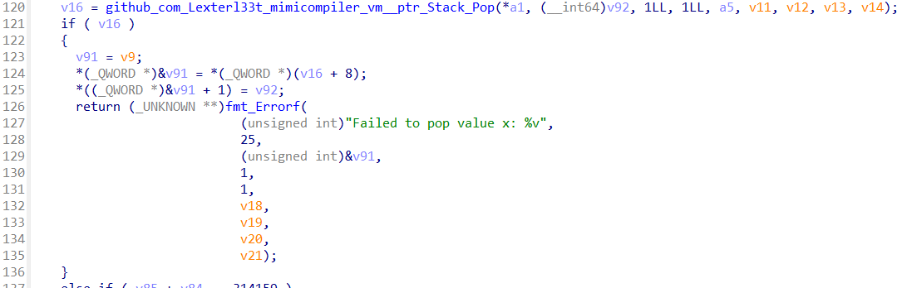

> A new and obscure programming language, MimiLang, has surfaced. It runs on a peculiar interpreter, but something about it feels… off. Dive into its inner workings and figure out what's really going on. Maybe you'll uncover something unexpected.
>
> Author : `Lxt3h`
>
> Flag format: `PWNME{.........................}`

by Lxt3h

---

Given a file `mimicompiler` which is a binary file. We can open it in **Ghidra** and see the decompiled code.



So we can see that the binary is a compiler and interpreter for the language. The binary has some functions like `github_com_Lexterl33t_mimicompiler_compiler__ptr_Compiler_Compile` and `github_com_Lexterl33t_mimicompiler_vm__ptr_VM_Run`. We found interesting statement parser function `github_com_Lexterl33t_mimicompiler_compiler__ptr_Parser_VerifyProofStatement` which is used to verify the proof.

```c
v44[0] = "verifyProof";
v44[1] = 11LL;
v44[2] = v42;
v44[3] = 28LL;
v44[4] = v41;
```

The statement `verifyProof` is used to verify the proof. So in the `VM` namespace we can also see how the `verifyProof` statement is used. The function `github_com_Lexterl33t_mimicompiler_vm__ptr_VM_VerifyProof` is used to verify the proof.




So it will pop the top two values from the stack and compare them. The first value is stored in the `v84` (`y`) variable and the second value is stored in the `v85` (`x`) variable.

```c
if ( v85 + v84 == 314159 )
{
    v22 = v85 * v84;
    v23 = (v85 * v85 + v84 * v84 * v84 - v85 * v84) % 1048573;
    if ( v23 == 273262 ) {
        // Do some operation and call decryptFlag
    }
}
```

So we need to find the value of `x` and `y` such that `x + y = 314159` and `(x * x + y * y * y - x * y) % 1048573 = 273262`. Because this is compiler and interpreter, we can write the solver in the language itself (because we know the syntax of the language from the decompiled code and its support to solve the problem).

```
init vv = 0;
init vvv = 1;
init vvvv = 0;

while vvv < 314159 {
    if vvvv == 273262 {
        verifyProof(vvv, vv);
        rea vvv = 314159;
        break;
    } else {
        rea vvv = vvv + 1;
        rea vv = 314159 - vvv;
        rea vvvv = (vvv * vvv + vv * vv * vv - vvv * vv) % 1048573;
    }
}
```

Why there `rea vvv = 314159;`? Because the `break` statement is not working as expected. So we need to assign the value of `vvv` to `314159` to break the loop.

Compile and running the code with following command:

```
./mimicompiler -f solver.mimi
```
