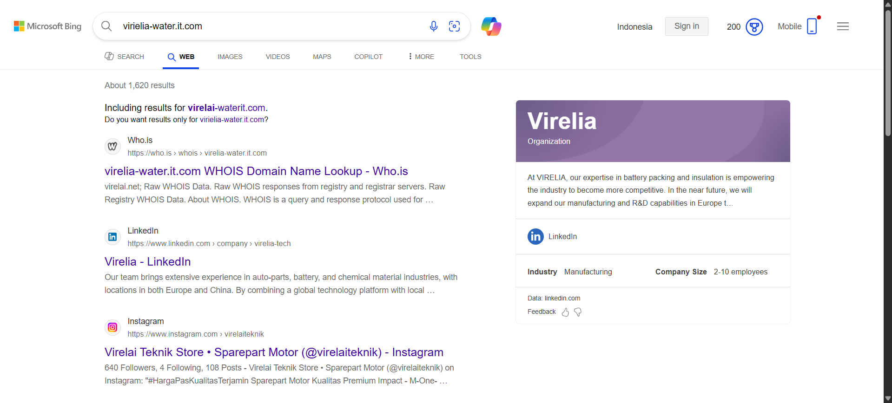
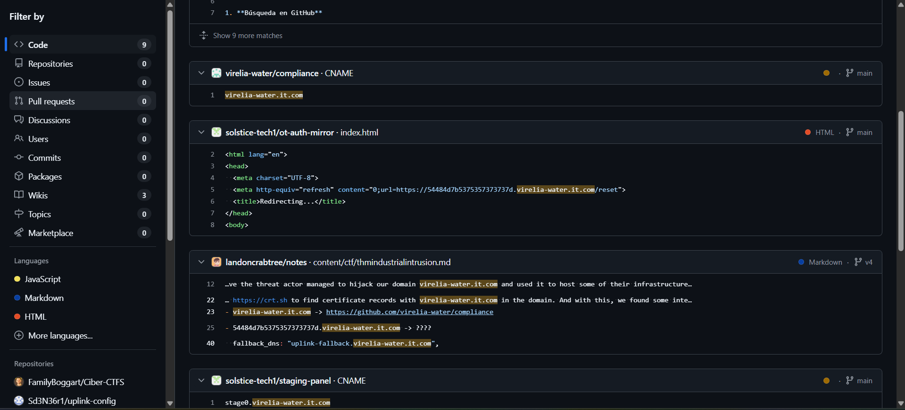

> “Hexline, we need your help investigating the phishing attack from 3 months ago. We believe the threat actor managed to hijack our domain `virielia-water.it.com` and used it to host some of their infrastructure at the time. Use your OSINT skills to find information about the infrastructure they used during their campaign.”

---

To begin the investigation, we searched the domain `virielia-water.it.com` on Bing. This search was conducted to verify if the domain was a typo or if it had any relevant information indexed.

The search results revealed that the domain `virielia-water.it.com` was indeed a typo. The correct domain is `virelia-water.it.com`. The website is hosted on GitHub.

Next, we searched the corrected domain `virelia-water.it.com` on GitHub.

The search results showed that the domain `virelia-water.it.com` we discovered a subdomain associated with the domain that contained hexadecimal data.

The hexadecimal name found in the subdomain was converted to text to reveal the flag.
