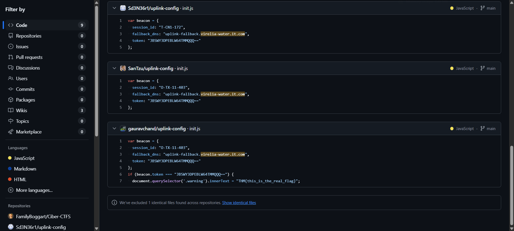

> “Great work on uncovering that suspicious subdomain, Hexline. However, your work here isn’t done yet, we believe there is more.”

---

Continuing from OSINT 1, we identified another subdomain associated with the domain `virelia-water.it.com`. The subdomain is `uplink-fallback.virelia-water.it.com`. This discovery was made during further analysis of the domain's hosting infrastructure.



To understand the purpose of the variable `beacon` found in the repository, we consulted ChatGPT. The explanation revealed that `beacon` is likely related to DNS functionality, possibly used for communication or signaling purposes within the infrastructure.

To investigate the subdomain further, we used the `dig` command to query its TXT records. The command used was:

```sh
$ dig TXT uplink-fallback.virelia-water.it.com

; <<>> DiG 9.20.9-1-Debian <<>> TXT uplink-fallback.virelia-water.it.com
;; global options: +cmd
;; Got answer:
;; ->>HEADER<<- opcode: QUERY, status: NOERROR, id: 57381
;; flags: qr rd ra; QUERY: 1, ANSWER: 1, AUTHORITY: 0, ADDITIONAL: 1

;; OPT PSEUDOSECTION:
; EDNS: version: 0, flags:; udp: 512
;; QUESTION SECTION:
;uplink-fallback.virelia-water.it.com. IN TXT

;; ANSWER SECTION:
uplink-fallback.virelia-water.it.com. 1799 IN TXT "REDACTEDBASE64="

;; Query time: 40 msec
;; SERVER: 10.255.255.254#53(10.255.255.254) (UDP)
;; WHEN: Mon Jun 30 10:37:01 +07 2025
;; MSG SIZE  rcvd: 162

```

This command queries the DNS server for TXT records associated with the subdomain. TXT records often contain metadata or encoded information.

The query revealed a Base64 encoded string in the TXT record. This encoded string was then decoded to extract the flag.

