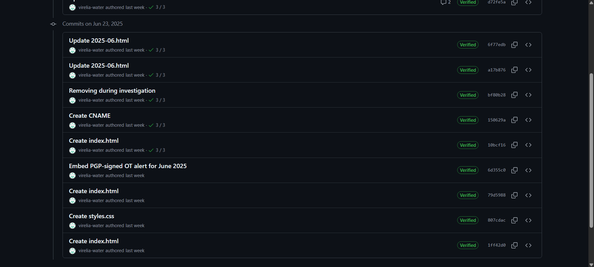
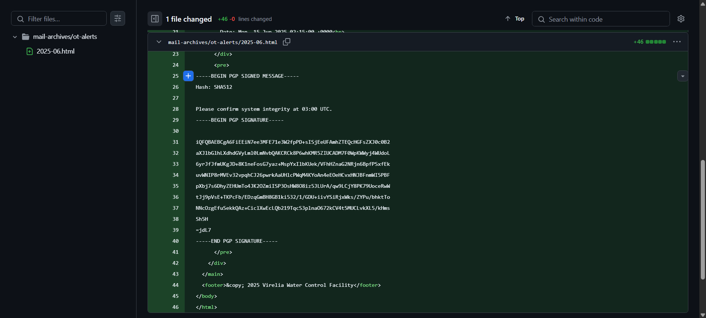

> After the initial breach, a single OT-Alert appeared in Virelia’s monthly digest—an otherwise unremarkable maintenance notice, mysteriously signed with PGP. Corporate auditors quietly removed the report days later, fearing it might be malicious. Your mission is to uncover more information about this mysterious signed PGP maintenance message.

---

Continuing from OSINT 2, we identified a GitHub user named `virelia-water`. This user has a repository containing commit messages related to the domain `virelia-water.it.com`.



Among the commit messages, one stood out: `Embed PGP-signed OT alert for June 2025`. This commit initially contained a PGP-signed message but was later deleted.



The commit included a PGP-signed message, which was extracted for further analysis. The message is as follows:

```
-----BEGIN PGP SIGNED MESSAGE-----Add commentMore actions
Hash: SHA512

Please confirm system integrity at 03:00 UTC.
-----BEGIN PGP SIGNATURE-----

iQFQBAEBCgA6FiEEiN7ee3MFE71e3W2fpPD+sISjEeUFAmhZTEQcHGFsZXJ0c0B2
aXJlbGlhLXdhdGVyLml0LmNvbQAKCRCk8P6whKMR5ZIUCADM7F0WpKWWyj4WUdoL
6yrJfJfmUKgJD+8K1neFosG7yaz+MspYxIlbKUek/VFhHZnaG2NRjn6BpfPSxfEk
uvWNIP8rMVEv32vpqhCJ26pwrkAaUHlcPWqM4KYoAn4eEOeHCvxHNJBFnmWI5PBF
pXbj7s6DhyZEHUmTo4JK2OZmiISP3OsHW8O8iz5JLUrA/qw9LCjY8PK79UoceRwW
tJj9pVsE+TKPcFb/EDzqGmBH8GB1ki532/1/GDU+iivYSiRjxWks/ZYPu/bhktTo
NNcOzgEfuSekkQAz+CiclXwEcLQb219TqcS3plnaO672kCV4t5MUCLvkXL5/kHms
Sh5H
=jdL7
-----END PGP SIGNATURE-----
```

To verify the authenticity of the PGP signature, the following command was used:

```sh
$ gpg --verify signature.asc
gpg: Signature made Mon 23 Jun 2025 07:44:52 PM +07
gpg:                using RSA key REDACTED
gpg:                issuer "alerts@virelia-water.it.com"
gpg: Good signature from "Ghost (THM{REDACTED}) <solstice.tech.ops@gmail.com>" [unknown]
gpg:                 aka "DarkPulse (THM{REDACTED}) <alerts@virelia-water.it.com>" [unknown]
gpg: WARNING: The key's User ID is not certified with a trusted signature!
gpg:          There is no indication that the signature belongs to the owner.
Primary key fingerprint: C9D5 2FA5 AC32 05AF ED0C  B242 F8ED 5BC2 8874 364F
     Subkey fingerprint: 88DE DE7B 7305 13BD 5EDD  6D9F A4F0 FEB0 84A3 11E5
```

To further analyze the key, it was retrieved from a keyserver using the following command:

```sh
gpg --keyserver keyserver.ubuntu.com --recv-keys REDACTED
```
