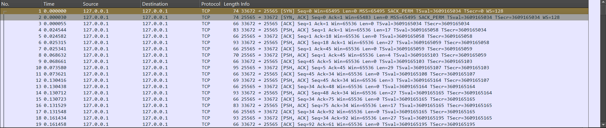
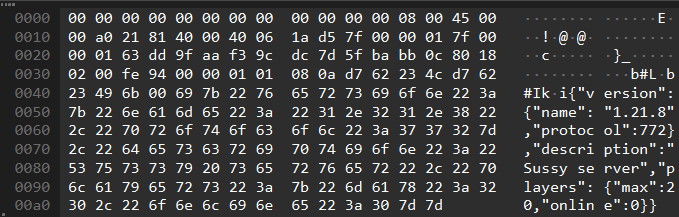
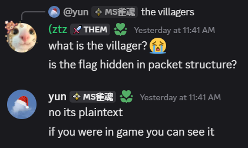
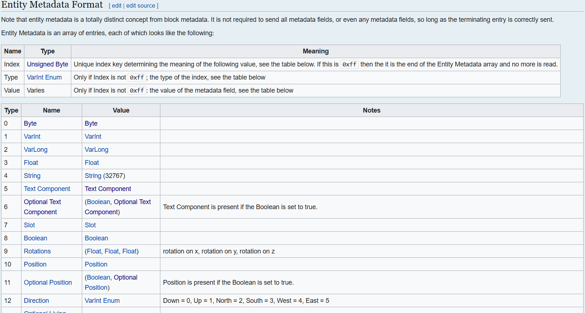
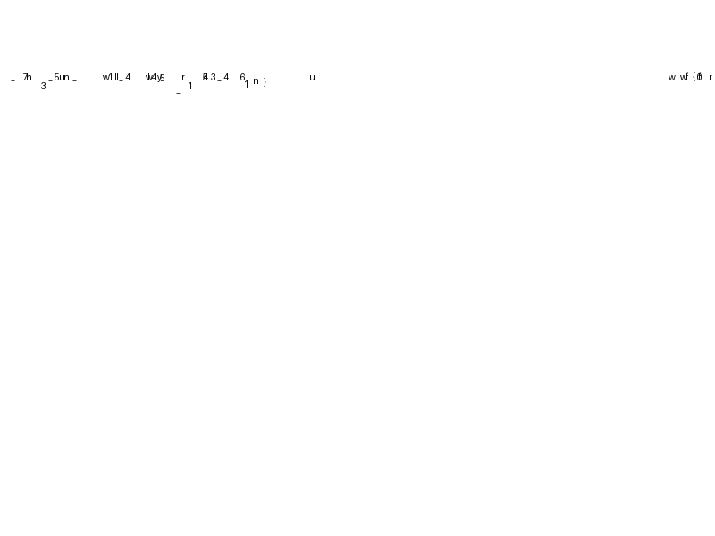

> I speedran minecraft!
>
> https://drive.google.com/file/d/1N4cpDroGDfEJbI0M74PCCMR_z-pjEOjc/view

by `yun`

---

<details>
<summary>wait but how do I read the packets?</summary>

https://minecraft.wiki/w/Java_Edition_protocol/Packets
</details>

<details>
<summary>second hint</summary>

my friend told me that villagers will help me speedrun minecraft, but they weren't very useful.
</details>

---

We are given a pcap file, when I open it there is a lot of communication between ports 25565 and 33672.



If you play Minecraft, you probably know that port 25565 is the port for the Minecraft server. Meanwhile, port 33672 is the port for the Minecraft client. So, we can conclude that this pcap file represents communication between the Minecraft client and server.

So, it seems impossible to analyze this pcap file manually, because it contains so many packets. So, we need to create a script to analyze this pcap file.

Here, we first need to understand how Minecraft communicates with the server and vice versa. We can see this in [Minecraft Protocol](https://minecraft.wiki/w/Java_Edition_protocol/Packets).

Towards the end of this pcap frame, we can see the version and protocol used by the server: 1.21.8 with protocol version 772. But this isn't too important, because there's already a hint on how to read the packets.



## How the packet is sent?

First of all, how are these packets sent? We can see this in the [Packet format](https://minecraft.wiki/w/Java_Edition_protocol/Packets#Packet_format) section. Each packet has a header containing information about the packet. There are two formats used: `without compression` and `with compression`. Since the default Minecraft server threshold setting is usually 256, we use the `with compression` header.

Okay, the structure of the `with compression` header is as follows:

<table><tbody><tr><th>Present?</th><th>Compressed?</th><th>Field Name</th><th>Field Type</th><th>Notes</th></tr><tr><td>always</td><td>No</td><td>Packet Length</td><td><a href="https://minecraft.wiki/w/Java_Edition_protocol/#Type:VarInt">VarInt</a></td><td>Length of (Data Length) + length of compressed (Packet ID + Data)</td></tr><tr><td rowspan="3">if size &gt;= threshold</td><td>No</td><td>Data Length</td><td><a href="https://minecraft.wiki/w/Java_Edition_protocol/#Type:VarInt">VarInt</a></td><td>Length of uncompressed (Packet ID + Data)</td></tr><tr><td rowspan="2">Yes</td><td>Packet ID</td><td><a href="https://minecraft.wiki/w/Java_Edition_protocol/#Type:VarInt">VarInt</a></td><td>zlib compressed packet ID (see the sections below)</td></tr><tr><td>Data</td><td><a href="https://minecraft.wiki/w/Java_Edition_protocol/#Type:Byte_Array">Byte Array</a></td><td>zlib compressed packet data (see the sections below)</td></tr><tr><td rowspan="3">if size &lt; threshold</td><td rowspan="3">No</td><td>Data Length</td><td><a href="https://minecraft.wiki/w/Java_Edition_protocol/#Type:VarInt">VarInt</a></td><td>0 to indicate uncompressed</td></tr><tr><td>Packet ID</td><td><a href="https://minecraft.wiki/w/Java_Edition_protocol/#Type:VarInt">VarInt</a></td><td>packet ID (see the sections below)</td></tr><tr><td>Data</td><td><a href="https://minecraft.wiki/w/Java_Edition_protocol/#Type:Byte_Array">Byte Array</a></td><td>packet data (see the sections below)</td></tr></tbody></table>

So we can see that each packet has a `Packet Length`, `Data Length`, `Packet ID`, and `Data`. So we can create a script to read this pcap file and retrieve the packets that have the `Packet ID` that matches the packet we need.

## How to read the packet?

In a PCAP file, each stored entry is called a frame, but a frame doesn't always equal a packet. This happens because, at the network level, data can be fragmented or combined.

To read Minecraft packets from a PCAP, the correct step is to first reconstruct the TCP stream by sorting and combining all segments based on their TCP sequence numbers. Once the stream is formed, we process it according to the Minecraft packet format.

## Reading the packet

~~I'll use the `scapy` library to read this pcap file and create a script to read the packets.~~ I will use `tshark` to read the pcap file and extract the TCP payloads. The reason for this is that `scapy` doesn't handle TCP stream reconstruction well, and `tshark` is more efficient for this task.

Since we're reading a pcap file, we'll be dealing with TCP frames, not Minecraft packets directly. We need to combine the data from the relevant TCP frames to form a complete stream. I'm using this code [Splitter](https://github.com/PrismarineJS/node-minecraft-protocol/blob/master/src/transforms/framing.js#L27) to help combine or split the stream into appropriate Minecraft packets.

Next, we'll read the Minecraft packets using the format we discussed earlier. We'll read the `Packet Length`, `Data Length`, `Packet ID`, and `Data` from each packet we receive. I use this code [Decompressor](https://github.com/PrismarineJS/node-minecraft-protocol/blob/master/src/transforms/compression.js#L41) to help decompress the packet that we have received if the packet is compressed (threshold &gt;= 256).

So I will convert the `Splitter` and `Decompressor` into Python code. Here's the code to read the packets from the pcap file:

```py
import subprocess
import zlib
# from scapy.all import PcapReader, TCP

SEGMENT_BITS = 0x7F
CONTINUE_BIT = 0x80

class PartialReadError(Exception):
    pass

def read_varint(data: bytes, offset: int = 0):
    value = 0
    position = 0
    index = offset

    while True:
        if index >= len(data):
            raise PartialReadError('Not enough bytes to read VarInt')

        current_byte = data[index]
        index += 1

        value |= (current_byte & SEGMENT_BITS) << position

        if (current_byte & CONTINUE_BIT) == 0:
            break

        position += 7
        if position >= 32:
            raise RuntimeError('VarInt is too big')

    return value, index - offset


def read_varlong(data: bytes, offset: int = 0):
    value = 0
    position = 0
    index = offset

    while True:
        if index >= len(data):
            raise PartialReadError('Not enough bytes to read VarLong')

        current_byte = data[index]
        index += 1

        value |= (current_byte & SEGMENT_BITS) << position

        if (current_byte & CONTINUE_BIT) == 0:
            break

        position += 7
        if position >= 64:
            raise RuntimeError('VarLong is too big')

    return value, index - offset

class EventEmitter:
    def __init__(self):
        self._events = {}

    def on(self, event, handler):
        self._events.setdefault(event, []).append(handler)

    def emit(self, event, *args, **kwargs):
        for handler in self._events.get(event, []):
            handler(*args, **kwargs)

class Splitter(EventEmitter):
    def __init__(self):
        super().__init__()
        self.buffer = bytearray()

    def feed(self, chunk: bytes):
        self.buffer.extend(chunk)

        offset = 0
        try:
            value, size = read_varint(self.buffer, offset)
        except PartialReadError:
            return

        while len(self.buffer) >= offset + size + value:
            packet = bytes(self.buffer[offset + size: offset + size + value])
            self.emit('packet', packet)
            offset += size + value

            try:
                value, size = read_varint(self.buffer, offset)
            except PartialReadError:
                break

        self.buffer = self.buffer[offset:]

def parse_packet(packet: bytes):
    packet_id, size = read_varint(packet, 0)
    data = packet[size:]

    print(f'Packet ID: {packet_id}, Length: {len(data)}')

splitter = Splitter()

splitter.on('packet', lambda pkt: print(f'Parsed Packet: {pkt.hex()}'))

# scapy make server packet will incorrectly feed to the splitter, dont know why.
# with PcapReader('challenge.pcap') as pcap_reader:
#     for pkt in pcap_reader:
#         if pkt.haslayer(TCP) and pkt[TCP].payload:
#             data = bytes(pkt[TCP].payload)
#             splitter.feed(data)

proc = subprocess.Popen(
    ['tshark', '-r', 'challenge.pcap', '-Y', 'tcp.srcport == 25565',
     '-T', 'fields', '-e', 'tcp.payload'],
    stdout=subprocess.PIPE,
    text=True,
)

for line in proc.stdout:
    data = bytes.fromhex(line.strip())
    splitter.feed(data)
```

## Parsing the packet

We have got the Minecraft packet from the pcap file, now we need to parse the packet based on the packet format we discussed earlier. 

```py
import subprocess
import zlib
# from scapy.all import PcapReader, TCP

...

class Decompressor(EventEmitter):
    def __init__(self, compression_threshold=-1):
        super().__init__()
        self.compression_threshold = compression_threshold

    def feed(self, chunk: bytes):
        print(f'Chunk: {chunk.hex()}')

        try:
            value, size = read_varint(chunk, 0)  # must be implemented
        except PartialReadError:
            return  # not enough bytes yet

        if value == 0:
            # No compression
            self.emit('packet', chunk[size:])
            return

        try:
            new_buf = zlib.decompress(chunk[size:], wbits=-zlib.MAX_WBITS)
        except Exception:
            return

        if len(new_buf) != value and not self.hide_errors:
            print(f'uncompressed length should be {value} but is {len(new_buf)}')

        self.emit('packet', new_buf)

def parse_packet(packet: bytes):
    packet_id, size = read_varint(packet, 0)
    data = packet[size:]

    print(f'Packet ID: {packet_id}, Length: {len(data)}')

    # Here we can parse the packet based on its ID

splitter = Splitter()
decompressor = Decompressor()

splitter.on('packet', lambda pkt: decompressor.feed(pkt))
decompressor.on('packet', lambda pkt: parse_packet(pkt))

...

for line in proc.stdout:
    data = bytes.fromhex(line.strip())
    splitter.feed(data)
```

Now we need to parse the packet's data. You can see the format of each protocol in [Minecraft Protocol](https://minecraft.wiki/w/Java_Edition_protocol/Packets).

## How to solve the challenge?

Based on the hint given, we need to look for packets related to villagers.



The challenge author stated that the flag is plaintext, but only if you're in-game. So, it's likely that the flag is separated into several pieces, and we need to combine them.

Some protocols related to entities and villagers are:

- `0x01` - add_entity
- `0x1F` - entity_position_sync
- `0x2E` - move_entity_pos
- `0x2F` - move_entity_pos_rot
- `0x31` - move_entity_rot
- `0x5C` - set_entity_data
- `0x6D` - sound_entity
- And many more...

### Identifying Villager Entities

So we have a few protocols we can use to find the flag. So what's the first step? Well, we need to check the `add_entity` (`0x01`) protocol.

<table><tbody><tr><th>Packet ID</th><th>State</th><th>Bound To</th><th>Field Name</th><th>Field Type</th><th>Notes</th></tr><tr><td rowspan="13"><i>protocol:</i><br><code>0x01</code><br><br><i>resource:</i><br><code>add_entity</code></td><td rowspan="13">Play</td><td rowspan="13">Client</td><td>Entity ID</td><td><a href="https://minecraft.wiki/w/Java_Edition_protocol/#Type:VarInt">VarInt</a></td><td>A unique integer ID mostly used in the protocol to identify the entity.</td></tr><tr><td>Entity UUID</td><td><a href="https://minecraft.wiki/w/Java_Edition_protocol/#Type:UUID">UUID</a></td><td>A unique identifier that is mostly used in persistence and places where the uniqueness matters more.</td></tr><tr><td>Type</td><td><a href="https://minecraft.wiki/w/Java_Edition_protocol/#Type:VarInt">VarInt</a></td><td>ID in the <code>minecraft:entity_type</code> registry (see "type" field in <a href="https://minecraft.wiki/w/Java_Edition_protocol/Entity_metadata#Entities">Entity metadata#Entities</a>).</td></tr><tr><td>X</td><td><a href="https://minecraft.wiki/w/Java_Edition_protocol/#Type:Double">Double</a></td><td></td></tr><tr><td>Y</td><td><a href="https://minecraft.wiki/w/Java_Edition_protocol/#Type:Double">Double</a></td><td></td></tr><tr><td>Z</td><td><a href="https://minecraft.wiki/w/Java_Edition_protocol/#Type:Double">Double</a></td><td></td></tr><tr><td>Pitch</td><td><a href="https://minecraft.wiki/w/Java_Edition_protocol/#Type:Angle">Angle</a></td><td>To get the real pitch, you must divide this by (256.0F / 360.0F)</td></tr><tr><td>Yaw</td><td><a href="https://minecraft.wiki/w/Java_Edition_protocol/#Type:Angle">Angle</a></td><td>To get the real yaw, you must divide this by (256.0F / 360.0F)</td></tr><tr><td>Head Yaw</td><td><a href="https://minecraft.wiki/w/Java_Edition_protocol/#Type:Angle">Angle</a></td><td>Only used by living entities, where the head of the entity may differ from the general body rotation.</td></tr><tr><td>Data</td><td><a href="https://minecraft.wiki/w/Java_Edition_protocol/#Type:VarInt">VarInt</a></td><td>Meaning dependent on the value of the Type field, see <a href="https://minecraft.wiki/w/Minecraft_Wiki:Projects/wiki.vg_merge/Object_Data">Object Data</a> for details.</td></tr><tr><td>Velocity X</td><td><a href="https://minecraft.wiki/w/Java_Edition_protocol/#Type:Short">Short</a></td><td rowspan="3">Same units as <a href="https://minecraft.wiki/w/Java_Edition_protocol/#Set_Entity_Velocity">Set Entity Velocity</a>.</td></tr><tr><td>Velocity Y</td><td><a href="https://minecraft.wiki/w/Java_Edition_protocol/#Type:Short">Short</a></td></tr><tr><td>Velocity Z</td><td><a href="https://minecraft.wiki/w/Java_Edition_protocol/#Type:Short">Short</a></td></tr></tbody></table>

So, we can see that the `add_entity` packet has several fields. We'll look for packets that have a `Type` that matches villager, which is `minecraft:villager`. We can see a list of entity types in the [Entity Type Registry](https://minecraft.wiki/w/Java_Edition_protocol/Entity_metadata#Entities).

We found that `minecraft:villager` has an ID of `134`. So, we'll look for packets that have a `Type` of `134`.

```py
def parse_packet(packet: bytes):
    packet_id, size = read_varint(packet, 0)
    data = packet[size:]

    # print(f'Packet ID: {packet_id}, Length: {len(data)}')

    if packet_id == 0x01:  # add_entity
        entity_id, offset = read_varint(data, 0)
        
        entity_uuid = data[offset:offset + 16]
        offset += 16

        data = data[offset:]
        offset = 0

        entity_type, offset = read_varint(data, 0)

        if entity_type == 134:  # minecraft:villager
            x, y, z = struct.unpack('>ddd', data[offset:offset + 24])
            pitch, yaw, head_yaw = struct.unpack('bbb', data[offset + 24:offset + 24 + 3])

            data = data[offset + 24 + 3:]
            offset = 0

            data_length, offset = read_varint(data, 0)
            velocity_x, velocity_y, velocity_z = struct.unpack('>hhh', data[offset:offset + 6])
            
            print(f'Found villager entity: ID={entity_id}, UUID={entity_uuid.hex()}, Position=({x}, {y}, {z}), '
                  f'Rotation=({pitch}, {yaw}, {head_yaw}), Velocity=({velocity_x}, {velocity_y}, {velocity_z})')
```

The output will be like this:

```
Found villager entity: ID=1637, UUID=69f564f0fe5346c6a4ee897acaa6ec19, Position=(82.5, 128.0, 5.5), Rotation=(0, 70, 70), Velocity=(0, 0, 0)
Found villager entity: ID=1638, UUID=7e68a42acbf14c318f124225c90c5f40, Position=(83.5, 128.0, 5.5), Rotation=(0, 79, 79), Velocity=(0, 0, 0)
Found villager entity: ID=1639, UUID=66614587aab14760a8f70ad7cf4219b7, Position=(84.5, 128.0, 5.5), Rotation=(0, 56, 56), Velocity=(0, 0, 0)
Found villager entity: ID=1640, UUID=6c5a50aa29354ae4bf22a3b24b513934, Position=(85.5, 128.0, 5.5), Rotation=(0, -46, -46), Velocity=(0, 0, 0)
Found villager entity: ID=1641, UUID=cc0995314ccd4946b9f1ebcbdb330c91, Position=(86.5, 128.0, 5.5), Rotation=(0, 33, 33), Velocity=(0, 0, 0)
Found villager entity: ID=1642, UUID=57d75f45955b4776aa2f1a279bf4df77, Position=(87.5, 128.0, 5.5), Rotation=(0, 39, 39), Velocity=(0, 0, 0)
Found villager entity: ID=1643, UUID=de1cbae6a00c46ccbecf26be504a926b, Position=(88.5, 128.0, 5.5), Rotation=(0, -30, -30), Velocity=(0, 0, 0)
Found villager entity: ID=1644, UUID=faff95bd97a44f639de1632ec2cb6077, Position=(89.5, 128.0, 5.5), Rotation=(0, 58, 58), Velocity=(0, 0, 0)
Found villager entity: ID=1645, UUID=7e749328741241b0a6cefdc554a54dd9, Position=(90.5, 128.0, 5.5), Rotation=(0, -46, -46), Velocity=(0, 0, 0)
Found villager entity: ID=1646, UUID=fbcdbb73a1fe4b22a1612faa9c228c07, Position=(91.5, 128.0, 5.5), Rotation=(0, 28, 28), Velocity=(0, 0, 0)
Found villager entity: ID=1647, UUID=12f98dd4001344aea136927e11a8168b, Position=(92.5, 128.0, 5.5), Rotation=(0, 48, 48), Velocity=(0, 0, 0)
Found villager entity: ID=1648, UUID=abcfcf8393c040f7ae6cfe3777696e07, Position=(93.5, 128.0, 5.5), Rotation=(0, -91, -91), Velocity=(0, 0, 0)
Found villager entity: ID=1649, UUID=af326bfe16bf4f0694636aefe89e0573, Position=(94.5, 128.0, 5.5), Rotation=(0, 84, 84), Velocity=(0, 0, 0)
Found villager entity: ID=1650, UUID=f05eabf11c8749bfa3e67817301539a4, Position=(95.5, 128.0, 5.5), Rotation=(0, -103, -103), Velocity=(0, 0, 0)
Found villager entity: ID=2000, UUID=6ca44b92b6d146c68060bd177016a563, Position=(97.5, 128.0, 5.5), Rotation=(0, 76, 76), Velocity=(0, 0, 0)
Found villager entity: ID=2001, UUID=5df42e2d2aa54cb09b6dd37955a9e377, Position=(98.5, 128.0, 5.5), Rotation=(0, 99, 99), Velocity=(0, 0, 0)
Found villager entity: ID=2002, UUID=73e35ea6e0b044f38a9027442a81021c, Position=(99.5, 128.0, 5.5), Rotation=(0, -121, -121), Velocity=(0, 0, 0)
Found villager entity: ID=2116, UUID=0b7379c873c24c5f920f530baf0b1edb, Position=(99.5, 128.0, 4.5), Rotation=(0, 5, 5), Velocity=(0, 0, 0)
Found villager entity: ID=2128, UUID=81d939ad8d7b4e0093c4e7d987863f0d, Position=(100.5, 128.0, 4.5), Rotation=(0, -78, -78), Velocity=(0, 0, 0)
Found villager entity: ID=2129, UUID=22d8867f61824e4082bb6c5844e91534, Position=(101.5, 128.0, 4.5), Rotation=(0, -119, -119), Velocity=(0, 0, 0)
Found villager entity: ID=2132, UUID=2f05206b91bd48d9a0cb92b9d909a6a2, Position=(102.5, 128.0, 4.5), Rotation=(0, 67, 67), Velocity=(0, 0, 0)
Found villager entity: ID=2133, UUID=a7fa048ec80e4650ba0516b481f487c0, Position=(103.5, 128.0, 4.5), Rotation=(0, -68, -68), Velocity=(0, 0, 0)
Found villager entity: ID=2135, UUID=d5ab5661986a4e02ada2247cf2571de1, Position=(104.5, 128.0, 4.5), Rotation=(0, -80, -80), Velocity=(0, 0, 0)
Found villager entity: ID=2180, UUID=10482296c54e4b05836690e6c2c05909, Position=(101.5, 128.0, -1.5), Rotation=(0, 108, 108), Velocity=(0, 0, 0)
Found villager entity: ID=2181, UUID=744a536355ac4c9285900c374a76ef3b, Position=(103.5, 128.0, -1.5), Rotation=(0, 42, 42), Velocity=(0, 0, 0)
Found villager entity: ID=2182, UUID=7686449d937847dab37d33f9271e5c3a, Position=(103.5, 128.0, -2.5), Rotation=(0, -97, -97), Velocity=(0, 0, 0)
Found villager entity: ID=2207, UUID=0a97c68344874991b27e2f086d092024, Position=(102.5, 128.0, -0.5), Rotation=(0, 90, 90), Velocity=(0, 0, 0)
Found villager entity: ID=2208, UUID=0437bab79e0f47d6afcc1625a970f462, Position=(103.5, 128.0, -1.5), Rotation=(0, 43, 43), Velocity=(0, 0, 0)
Found villager entity: ID=2209, UUID=ff9b3a13201640d58ccda7895a411175, Position=(105.5, 128.0, 1.5), Rotation=(0, -114, -114), Velocity=(0, 0, 0)
Found villager entity: ID=2210, UUID=25cdd97a0be94126a31a30124cf4a255, Position=(101.5, 128.0, 1.5), Rotation=(0, -36, -36), Velocity=(0, 0, 0)
Found villager entity: ID=2211, UUID=984003786416417f9e1de2b35149993a, Position=(102.5, 128.0, 1.5), Rotation=(0, 24, 24), Velocity=(0, 0, 0)
Found villager entity: ID=2212, UUID=81baf0c07a604ddc829c301eac9446d2, Position=(103.5, 128.0, 1.5), Rotation=(0, 84, 84), Velocity=(0, 0, 0)
Found villager entity: ID=2229, UUID=bba191fd688d4b7e851cb7293811bc0f, Position=(85.5, 128.0, 1.5), Rotation=(0, 26, 26), Velocity=(0, 0, 0)
Found villager entity: ID=2931, UUID=c6c975741b9c4faf8f93459ce64e71c4, Position=(94.5, 128.0, 1.5), Rotation=(0, -34, -34), Velocity=(0, 0, 0)
Found villager entity: ID=3303, UUID=75f5d674845d4dfda532e2326938c110, Position=(104.5, 128.0, 4.5), Rotation=(0, -60, -60), Velocity=(0, 0, 0)
Found villager entity: ID=3837, UUID=aa3586fc837544cd82bac8221a8f9fa4, Position=(85.5, 128.0, 1.5), Rotation=(0, -26, -26), Velocity=(0, 0, 0)
Found villager entity: ID=3875, UUID=5a6d7a17e9ae4cc18cb3ca79811d9187, Position=(85.5, 128.0, 1.5), Rotation=(0, 14, 14), Velocity=(0, 0, 0)
Found villager entity: ID=4058, UUID=1a58a5d94bc243a199de3490c5b3ba0f, Position=(87.5, 128.0, 1.5), Rotation=(0, -52, -52), Velocity=(0, 0, 0)
Found villager entity: ID=4275, UUID=ec321c58ac6a42479ff91292f8817d2c, Position=(106.5, 128.0, 4.5), Rotation=(0, 57, 57), Velocity=(0, 0, 0)
Found villager entity: ID=4642, UUID=677ce2fb72ad4932a33142ac9d48ad5c, Position=(105.5, 128.0, 1.5), Rotation=(0, -30, -30), Velocity=(0, 0, 0)
```

### Extracting Villager Metadata

So, 40 villager entities were found. So where are the flags? Based on my very clever ChatGPT, when I asked about all the protocols related to entities or villagers, one protocol stood out: `set_entity_data` (`0x5C`).

> Before I asked ChatGPT, I searched for different protocols related to entities and villagers, and then I gave up because there were too many protocols. So I asked ChatGPT where the flag was spread, and it gave me a list of protocols related to entities and villagers. I was surprised that it gave me the `set_entity_data` protocol, which is the protocol we need.

```py
villager_entities = []

def parse_packet(packet: bytes):
    packet_id, size = read_varint(packet, 0)
    data = packet[size:]

    # print(f'Packet ID: {packet_id}, Length: {len(data)}')

    ...

    if packet_id == 0x5C:  # set_entity_data
        entity_id, offset = read_varint(data, 0)
        metadata_index = struct.unpack('>B', data[offset:offset + 1])[0]
        offset += 1
        
        metadata = data[offset:]
        metadata_type, offset = read_varint(metadata, 0)

        metadata = metadata[offset:]
        if entity_id in [ent[0] for ent in villager_entities]:
            print(f'Found villager metadata for ID={entity_id}, Metadata Index={metadata_index}, Metadata Type={metadata_type}')
```

In this metadata entry, we need to parse it according to the metadata format in [Entity Metadata](https://minecraft.wiki/w/Java_Edition_protocol/Entity_metadata#Entity_Metadata_Format).



After reviewing several metadata types, I discovered that there's an Optional Text Component type that contains single-byte text. The metadata type is `6`, and the format is as follows:

| Type | Name | Value | Notes |
| --- | --- | --- | --- |
| 6 | [Optional Text Component](https://minecraft.wiki/w/Java_Edition_protocol/#Metadata_type:Optional_Text_Component) | ([Boolean](https://minecraft.wiki/w/Java_Edition_protocol/Data_types#Type:Boolean "Java Edition protocol/Data types"), [Optional](https://minecraft.wiki/w/Java_Edition_protocol/Data_types#Type:Optional "Java Edition protocol/Data types") [Text Component](https://minecraft.wiki/w/Java_Edition_protocol/Data_types#Type:Text_Component "Java Edition protocol/Data types")) | Text Component is present if the Boolean is set to true. |

And the format of the `Text Component` is as follows:

| Name | Size (bytes) | Encodes | Notes |
| --- | --- | --- | --- |
| [Text Component](https://minecraft.wiki/w/Java_Edition_protocol/#Type:Text_Component) | Varies | See [Text component format](https://minecraft.wiki/w/Text_component_format "Text component format") | Encoded as a [NBT Tag](https://minecraft.wiki/w/Minecraft_Wiki:Projects/wiki.vg_merge/NBT "Minecraft Wiki:Projects/wiki.vg merge/NBT"), with the type of tag used depending on the case: - As a [String Tag](https://minecraft.wiki/w/Minecraft_Wiki:Projects/wiki.vg_merge/NBT#Specification:string_tag "Minecraft Wiki:Projects/wiki.vg merge/NBT"): For components only containing text (no styling, no events etc.). - As a [Compound Tag](https://minecraft.wiki/w/Minecraft_Wiki:Projects/wiki.vg_merge/NBT#Specification:compound_tag "Minecraft Wiki:Projects/wiki.vg merge/NBT"): Every other case. |

So in this metadata, we will look for the `Optional Text Component` type, which is `6`. If we find it, we will read the `Boolean` value to check if the text component is present. If it is present, we will read the `NBT Tag` because the text component is encoded as an NBT Tag. The NBT Tag can be either a `String Tag` or a `Compound Tag`, but in this case, we will only look for the `String Tag`.

```py
        if entity_id in [ent[0] for ent in villager_entities]:
            # print(f'Found villager metadata for ID={entity_id}, Metadata Index={metadata_index}, Metadata Type={metadata_type}')
            if metadata_type == 6:  # Optional Text Component
                has_text = struct.unpack('b', metadata[offset:offset + 1])
                offset += 1

                if has_text:
                    nbt_tag = struct.unpack('b', metadata[offset:offset + 1])[0]
                    _ = struct.unpack('b', metadata[offset + 1:offset + 2])[0]
                    string_length = struct.unpack('b', metadata[offset + 2:offset + 3])[0]
                    string_value = metadata[offset + 3:offset + 3 + string_length].decode('utf-8')
                    print(f'Found villager metadata for ID={entity_id}, NBT Tag={nbt_tag}, String Length={string_length}, String Value={string_value}')
```

And... we can see that some villager entities have metadata of type `Optional Text Component`, which contains a single-byte of text. But when we try to combine them based on their packet order, the flags look random, so we need to figure out how to combine them.

### Visualizing the Flag from Villager Positions

What if we try rendering the text with the position in `add_entity`?

```py
from PIL import Image, ImageDraw, ImageFont

...

villager_entities = []

def parse_packet(packet: bytes):
    packet_id, size = read_varint(packet, 0)
    data = packet[size:]

    ...

    if packet_id == 0x5C:  # set_entity_data
        entity_id, offset = read_varint(data, 0)
        metadata_index = struct.unpack('>B', data[offset:offset + 1])[0]
        offset += 1
        
        metadata = data[offset:]
        metadata_type, offset = read_varint(metadata, 0)

        metadata = metadata[offset:]
        offset = 0

        if entity_id in [ent[0] for ent in villager_entities]:
            # print(f'Found villager metadata for ID={entity_id}, Metadata Index={metadata_index}, Metadata Type={metadata_type}')
            if metadata_type == 6:  # Optional Text Component
                has_text = struct.unpack('b', metadata[offset:offset + 1])
                offset += 1

                if has_text:
                    nbt_tag = struct.unpack('b', metadata[offset:offset + 1])[0]
                    _ = struct.unpack('b', metadata[offset + 1:offset + 2])[0]
                    string_length = struct.unpack('b', metadata[offset + 2:offset + 3])[0]
                    string_value = metadata[offset + 3:offset + 3 + string_length].decode('utf-8')
                    # print(f'Found villager metadata for ID={entity_id}, NBT Tag={nbt_tag}, String Length={string_length}, String Value={string_value}')
                    for i, ent in enumerate(villager_entities):
                        if ent[0] == entity_id:
                            villager_entities[i] = (ent[0], ent[1], ent[2], ent[3], ent[4], ent[5], ent[6], ent[7], ent[8], ent[9], ent[10], string_value)

...

img = Image.new('RGB', (800, 600), color='white')
draw = ImageDraw.Draw(img)
font = ImageFont.load_default()
for ent in villager_entities:
    _, _, x, y, z, _, _, _, _, _, _, text = ent
    if not text:
        continue

    img_x = int(x * 10) % 800
    img_y = int(y * 10) % 600
    draw.text((img_x, img_y), text, fill='black', font=font)

img.save('villager_text.png')
```

But it's still a mess, so will the author fix the villager positions? It's time to look for other packets related to villager positions. 

So I found the `entity_position_sync` (`0x1F`) packet, which synchronizes entity positions.

```py
    if packet_id == 0x1F:  # entity_position_sync
        entity_id, offset = read_varint(data, 0)

        if entity_id in [ent[0] for ent in villager_entities]:
            x, y, z = struct.unpack('>ddd', data[offset:offset + 24])
            print(f'Entity Position Sync: ID={entity_id}, Position=({x}, {y}, {z})')
```

It seems like the villager's last sync position is the one that forms the flag? Because the `y` and `z` values don't vary, only the `x` values do. So let's try re-rendering with the villager's last position.

```py
from PIL import Image, ImageDraw, ImageFont

...

villager_entities = []

def parse_packet(packet: bytes):
    packet_id, size = read_varint(packet, 0)
    data = packet[size:]

    ...

    if packet_id == 0x1F:  # entity_position_sync
        entity_id, offset = read_varint(data, 0)

        if entity_id in [ent[0] for ent in villager_entities]:
            x, y, z = struct.unpack('>ddd', data[offset:offset + 24])
            print(f'Entity Position Sync: ID={entity_id}, Position=({x}, {y}, {z})')
            for i, ent in enumerate(villager_entities):
                if ent[0] == entity_id:
                    villager_entities[i] = (ent[0], ent[1], x, y, z, ent[5], ent[6], ent[7], ent[8], ent[9], ent[10], ent[11])

...

img = Image.new('RGB', (800, 600), color='white')
draw = ImageDraw.Draw(img)
font = ImageFont.load_default()
for ent in villager_entities:
    _, _, x, y, z, _, _, _, _, _, _, text = ent
    if not text:
        continue

    img_x = int(x * 10) % 800
    img_y = int(y * 10) % 600
    draw.text((img_x, img_y), text, fill='black', font=font)

img.save('villager_text.png')
```

And sure enough after we use the last position of `entity_position_sync`, the resulting text looks like a flag.



## Final Script

Here's the final script that combines everything:

```py
import struct
import subprocess
import zlib
# from scapy.all import PcapReader, TCP
from PIL import Image, ImageDraw, ImageFont

SEGMENT_BITS = 0x7F
CONTINUE_BIT = 0x80

class PartialReadError(Exception):
    pass

def read_varint(data: bytes, offset: int = 0):
    value = 0
    position = 0
    index = offset

    while True:
        if index >= len(data):
            raise PartialReadError('Not enough bytes to read VarInt')

        current_byte = data[index]
        index += 1

        value |= (current_byte & SEGMENT_BITS) << position

        if (current_byte & CONTINUE_BIT) == 0:
            break

        position += 7
        if position >= 32:
            raise RuntimeError('VarInt is too big')

    return value, index - offset


def read_varlong(data: bytes, offset: int = 0):
    value = 0
    position = 0
    index = offset

    while True:
        if index >= len(data):
            raise PartialReadError('Not enough bytes to read VarLong')

        current_byte = data[index]
        index += 1

        value |= (current_byte & SEGMENT_BITS) << position

        if (current_byte & CONTINUE_BIT) == 0:
            break

        position += 7
        if position >= 64:
            raise RuntimeError('VarLong is too big')

    return value, index - offset

class EventEmitter:
    def __init__(self):
        self._events = {}

    def on(self, event, handler):
        self._events.setdefault(event, []).append(handler)

    def emit(self, event, *args, **kwargs):
        for handler in self._events.get(event, []):
            handler(*args, **kwargs)

class Splitter(EventEmitter):
    def __init__(self):
        super().__init__()
        self.buffer = bytearray()

    def feed(self, chunk: bytes):
        self.buffer.extend(chunk)

        offset = 0
        try:
            value, size = read_varint(self.buffer, offset)
        except PartialReadError:
            return

        while len(self.buffer) >= offset + size + value:
            packet = bytes(self.buffer[offset + size: offset + size + value])
            self.emit('packet', packet)
            offset += size + value

            try:
                value, size = read_varint(self.buffer, offset)
            except PartialReadError:
                break

        self.buffer = self.buffer[offset:]

class Decompressor(EventEmitter):
    def __init__(self, compression_threshold=-1):
        super().__init__()
        self.compression_threshold = compression_threshold

    def feed(self, chunk: bytes):
        try:
            value, size = read_varint(chunk, 0)  # must be implemented
        except PartialReadError:
            return  # not enough bytes yet

        if value == 0:
            # No compression
            self.emit('packet', chunk[size:])
            return

        try:
            new_buf = zlib.decompress(chunk[size:], wbits=-zlib.MAX_WBITS)
        except Exception:
            return

        if len(new_buf) != value and not self.hide_errors:
            print(f'uncompressed length should be {value} but is {len(new_buf)}')

        self.emit('packet', new_buf)

villager_entities = []

def parse_packet(packet: bytes):
    packet_id, size = read_varint(packet, 0)
    data = packet[size:]

    # print(f'Packet ID: {packet_id}, Length: {len(data)}')

    if packet_id == 0x01:  # add_entity
        entity_id, offset = read_varint(data, 0)
        
        entity_uuid = data[offset:offset + 16]
        offset += 16

        data = data[offset:]
        offset = 0

        entity_type, offset = read_varint(data, 0)

        if entity_type == 134:  # minecraft:villager
            x, y, z = struct.unpack('>ddd', data[offset:offset + 24])
            pitch, yaw, head_yaw = struct.unpack('bbb', data[offset + 24:offset + 24 + 3])

            data = data[offset + 24 + 3:]
            offset = 0

            data_length, offset = read_varint(data, 0)
            velocity_x, velocity_y, velocity_z = struct.unpack('>hhh', data[offset:offset + 6])

            villager_entities.append((entity_id, entity_uuid, x, y, z, pitch, yaw, head_yaw, velocity_x, velocity_y, velocity_z, ''))
            
            # print(f'Found villager entity: ID={entity_id}, UUID={entity_uuid.hex()}, Position=({x}, {y}, {z}), '
            #       f'Rotation=({pitch}, {yaw}, {head_yaw}), Velocity=({velocity_x}, {velocity_y}, {velocity_z})')

    if packet_id == 0x5C:  # set_entity_data
        # Read unsigned byte for entity ID (dont use read_varint)
        entity_id, offset = read_varint(data, 0)
        metadata_index = struct.unpack('>B', data[offset:offset + 1])[0]
        offset += 1
        
        metadata = data[offset:]
        metadata_type, offset = read_varint(metadata, 0)

        metadata = metadata[offset:]
        offset = 0

        if entity_id in [ent[0] for ent in villager_entities]:
            # print(f'Found villager metadata for ID={entity_id}, Metadata Index={metadata_index}, Metadata Type={metadata_type}')
            if metadata_type == 6:  # Optional Text Component
                has_text = struct.unpack('b', metadata[offset:offset + 1])
                offset += 1

                if has_text:
                    nbt_tag = struct.unpack('b', metadata[offset:offset + 1])[0]
                    _ = struct.unpack('b', metadata[offset + 1:offset + 2])[0]
                    string_length = struct.unpack('b', metadata[offset + 2:offset + 3])[0]
                    string_value = metadata[offset + 3:offset + 3 + string_length].decode('utf-8')
                    # print(f'Found villager metadata for ID={entity_id}, NBT Tag={nbt_tag}, String Length={string_length}, String Value={string_value}')
                    for i, ent in enumerate(villager_entities):
                        if ent[0] == entity_id:
                            villager_entities[i] = (ent[0], ent[1], ent[2], ent[3], ent[4], ent[5], ent[6], ent[7], ent[8], ent[9], ent[10], string_value)

    if packet_id == 0x1F:  # entity_position_sync
        entity_id, offset = read_varint(data, 0)

        if entity_id in [ent[0] for ent in villager_entities]:
            x, y, z = struct.unpack('>ddd', data[offset:offset + 24])
            print(f'Entity Position Sync: ID={entity_id}, Position=({x}, {y}, {z})')
            for i, ent in enumerate(villager_entities):
                if ent[0] == entity_id:
                    villager_entities[i] = (ent[0], ent[1], x, y, z, ent[5], ent[6], ent[7], ent[8], ent[9], ent[10], ent[11])

splitter = Splitter()
decompressor = Decompressor()

splitter.on('packet', lambda pkt: decompressor.feed(pkt))
decompressor.on('packet', lambda pkt: parse_packet(pkt))

# scapy make server packet will incorrectly feed to the splitter, dont know why.
# with PcapReader('challenge.pcap') as pcap_reader:
#     for pkt in pcap_reader:
#         if pkt.haslayer(TCP) and pkt[TCP].payload:
#             data = bytes(pkt[TCP].payload)
#             splitter.feed(data)

proc = subprocess.Popen(
    ['tshark', '-r', 'challenge.pcap', '-Y', 'tcp.srcport == 25565',
     '-T', 'fields', '-e', 'tcp.payload'],
    stdout=subprocess.PIPE,
    text=True,
)

for line in proc.stdout:
    data = bytes.fromhex(line.strip())
    splitter.feed(data)

img = Image.new('RGB', (800, 600), color='white')
draw = ImageDraw.Draw(img)
font = ImageFont.load_default()
for ent in villager_entities:
    _, _, x, y, z, _, _, _, _, _, _, text = ent
    if not text:
        continue

    img_x = int(x * 10) % 800
    img_y = int(y * 10) % 600
    draw.text((img_x, img_y), text, fill='black', font=font)

img.save('villager_text.png')
```

## Author solution GIF

The author also provided a GIF of their solution, which shows the process of moving the text to the correct positions.


