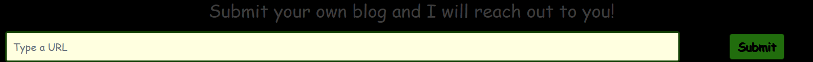

## Scenario

> One of our recruits is a massive conspiracy theorist. Strangely enough, he has expressed not only that everything is the bite of 87 but also that there's something strange going on in the dark web that involves Dr. Tom Lei. Though he is a little bit nuts, we think he may be on to something. Figure out what's going on before it's too late!

By [HackAndQuack](spookyctf/web/cryptid-hunters/README.md)

## Solution

There is a form on the website that allows you to submit a URL. The website will then request the URL and display the website's content.



After submitting a URL, the website will verify that the URL is a blog by checking if the URL contains the words `blog`, `cryptid`, `real`, `666`, and `.org`. If the URL contains all the words, the website will display the content of the website.

```py
def verifyBlog(url):
    blog_list = ["blog","cryptid","real","666",".org"]
    for word in blog_list:
        if word not in url:
            return False
    return True
```

To get the flag we need to request the `flag` page. The `flag` page is only accessible if the request is coming from `127.0.0.1`.

```py
@app.route('/flag')
def flag():
    if request.remote_addr == '::ffff:127.0.0.1' or request.remote_addr == '::1':
        return render_template('flag.html', FLAG=os.environ.get("FLAG"))

    else:
        return render_template('alarm.html'), 403
```

We need to spoof the URL to contain the words `blog`, `cryptid`, `real`, `666`, and `.org`. We can do this by using the URL `http://127.0.0.1/flag?blogcryptidreal666.org`
